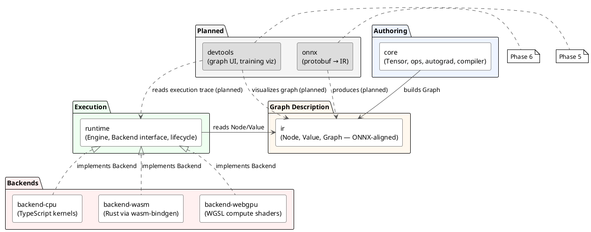
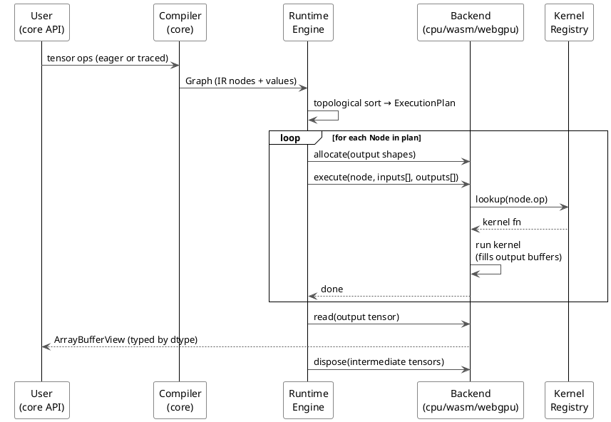
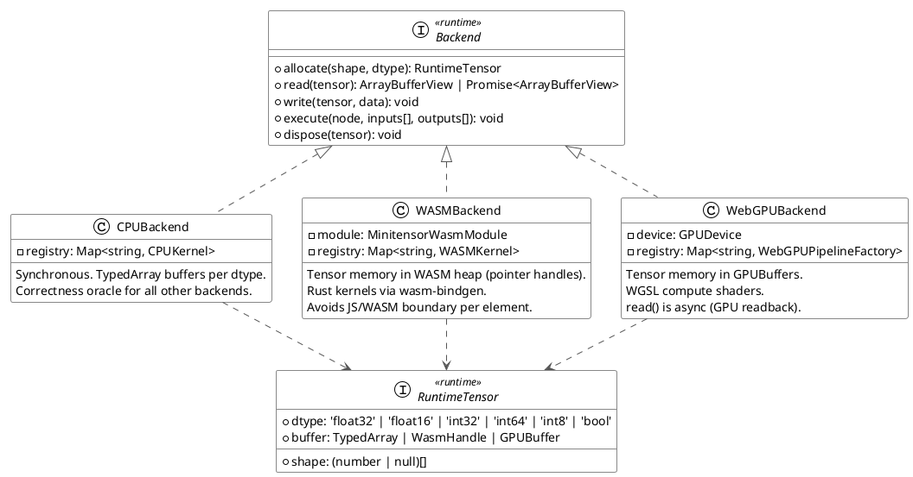
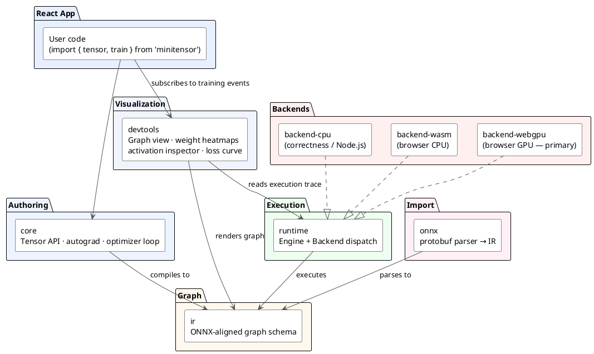

# minitensor

A tensor library that runs entirely in the browser. Train, visualize, and run inference with WebGPU acceleration as a TypeScript library.

> **Status: active development - building the foundation.**

---

## Vision

- **Train models in the browser.** Torch-like authoring API, autograd, and optimizer loop, executing on WebGPU, WASM (rust), and CPU (TypeScript).
- **Visualize model dynamics in real-time.** Watch weights, activations, and gradients update as training runs.
- **Load and run ONNX models.** Import a `.onnx` file and execute it via the same backend pipeline.
- **Drop into a React app.** All packages are TypeScript-first and browser-native.

---

## Architecture

### 1. Package Dependency Map



**Boundary rules — do not violate:**

| Package | Can | Cannot |
| --- | --- | --- |
| `core` | build graphs, eager ops, autograd | know backend memory layout |
| `ir` | describe computation, shapes, attributes | know about devices or gradients |
| `runtime` | execute graphs, dispatch to backend, manage tensor lifetime | implement op math |
| `backend-*` | run kernels, own memory | define user-facing tensor semantics |

---

### 2. Execution Data Flow



---

### 3. Backend Internal Structure



---

### 4. Target End-State Architecture



---

## Packages

| Package | Description | Status |
| --- | --- | --- |
| `packages/core` | Tensor class, eager ops, autograd, graph compiler | implemented |
| `packages/ir` | ONNX-aligned `Node` / `Value` / `Graph` schema | implemented |
| `packages/runtime` | `Backend` interface, `Engine`, tensor lifecycle | implemented |
| `packages/backend-cpu` | Reference backend. Float32Array kernels. | implemented |
| `packages/backend-wasm` | Rust kernels via wasm-bindgen. Memory in WASM heap. | scaffolded |
| `packages/backend-webgpu` | WGSL compute shaders. Async GPU readback. | partial |
| `packages/onnx` | Protobuf parser, ONNX op mapping to IR | not started |
| `packages/devtools` | Graph visualization, training dashboard | not started |

---

## Kernel Support Matrix

CPU is the correctness oracle. All other backends must match CPU output within tolerance.

| Op | CPU | WASM | WebGPU | Notes |
| --- | :---: | :---: | :---: | --- |
| Add | yes | yes | yes | same-shape only — `[N,D] + [D]` not supported |
| Sub | yes | yes | — | WebGPU kernel missing |
| Mul | yes | yes | yes | same-shape only — `[N,D] + [D]` not supported |
| Div | yes | yes | — | WebGPU kernel missing |
| MatMul | yes | yes | yes | 2D only; batched rank ≥ 3 not implemented |
| Transpose | yes | yes | yes | 2D only |
| Relu | — | — | — | needed for any real MLP |
| Sigmoid | — | — | — | |
| Softmax | — | — | — | |
| Reshape | — | — | — | |
| Concat | — | — | — | |

No backend has cross-backend parity tests. Correctness of WASM and WebGPU is unverified.

---

## Dtype Support

Common dtypes needed for real models, mapped to their current implementation state.

| Dtype | Type system | `allocate()` | Kernels | Notes |
| --- | :---: | :---: | :---: | --- |
| `float32` | yes | yes | yes (Float32Array) | primary dtype; all current ops use this |
| `float16` | — | — | — | important for WebGPU efficiency; not in type system yet |
| `int32` | yes | yes (Int32Array) | — | typed but kernels hardcode Float32Array |
| `int64` | — | — | — | needed for indices (Gather, Scatter) |
| `int8` | — | — | — | quantization |
| `bool` | yes | yes (Uint8Array) | — | typed; no logical op kernels |

`float16` should be the next dtype added — it unlocks half-precision on WebGPU and is the standard inference dtype for most ONNX models.

---

## Getting Started

**Prerequisites:** [Bun](https://bun.sh), `wasm-pack` (for WASM backend build)

```sh
bun install

# Build the WASM backend (required before running tests that use WASMBackend)
cd packages/backend-wasm && wasm-pack build --target bundler && cd ../..

bun run test        # run full test suite once
bun run test:watch  # watch mode
```

Tests use [Vitest](https://vitest.dev/). Browser/WebGPU tests run via Playwright (`@vitest/browser`).

### Current test coverage

| Suite | What it covers |
| --- | --- |
| `tests/autograd.test.ts` | Gradient computation, graph capture |
| `tests/elementwise.test.ts` | Add, Mul, Sub, Div — CPU only |
| `tests/matmul.test.ts` | 2D matrix multiply — CPU only |
| `tests/memory.test.ts` | Tensor allocation and disposal |

All suites run against CPU only. WASM and WebGPU are not tested against CPU oracle yet.

---

## Active Gaps (implementation targets)

These block the path to training and inference:

| Gap | Impact |
| --- | --- |
| No cross-backend parity tests | WASM/WebGPU correctness is unverified |
| No activation ops (Relu, Sigmoid, Softmax) | Cannot run a real forward pass |
| No broadcasting in binary ops | Bias addition `[N,D] + [D]` silently fails |
| Matmul and transpose are 2D-only | Batched ops needed for real models |
| No loss functions or optimizer | Cannot train |
| No ONNX parser | Cannot load pre-trained models |
| No devtools / visualization | Core differentiating feature is absent |
| WASM not validated in a real browser | Tests run under Node; browser runtime unconfirmed |

---

## Roadmap

| Phase | Deliverable | State |
| --- | --- | --- |
| 1 | Core IR, CPU backend, autograd graph capture | done |
| 2 | Cross-backend vertical slice: `y = Relu(MatMul(x,W) + b)` matches CPU on WASM + WebGPU | **next** |
| 3 | Full elementwise ops + broadcasting + batched matmul on all backends | follows phase 2 |
| 4 | Activation ops, loss functions, SGD/Adam — end-to-end training loop | follows phase 3 |
| 5 | `devtools` — graph viz, weight/activation inspector, real-time loss curve | parallel with 4 |
| 6 | `onnx` — protobuf parser, op mapping, inference from `.onnx` | after phase 4 |
| 7 | Optimizer passes, kernel fusion, buffer pooling | after phase 6 |

---

## Docs

- [docs/architecture.md](docs/architecture.md) — design decisions: backend contract, kernel registry, WASM memory model
- [docs/ir-reference.md](docs/ir-reference.md) — IR schema: Node/Value/Graph types, shape system, ONNX alignment
- [docs/adding-an-op.md](docs/adding-an-op.md) — checklist for adding a kernel across all three backends
- [docs/next.md](docs/next.md) — current state, immediate task, sharp edges
