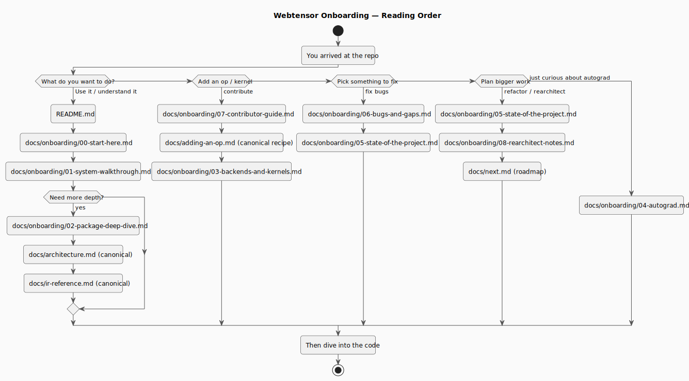
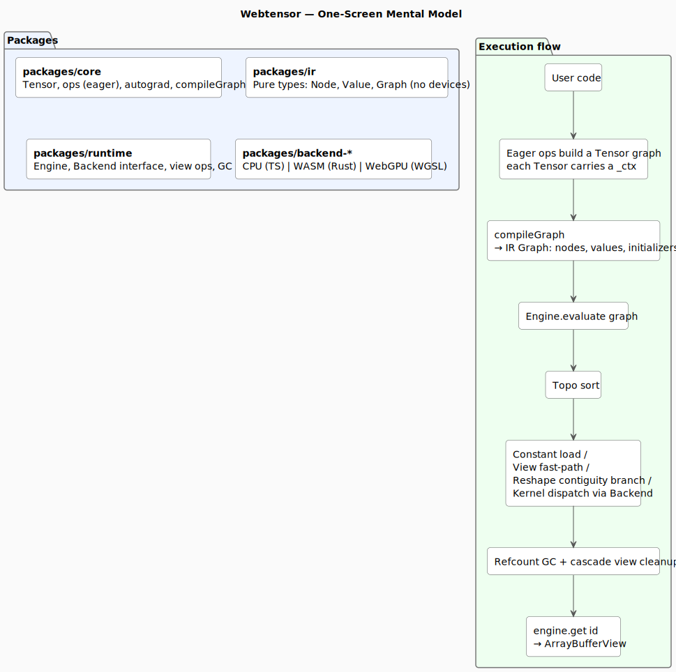

# 00 — Start Here

This folder is an **onboarding pack** for webtensor: a multi-backend (CPU / WASM / WebGPU) tensor library with eager autograd, written in TypeScript with Rust kernels for WASM.

The existing files at the top of `docs/` (`architecture.md`, `ir-reference.md`, `adding-an-op.md`, `next.md`) are the canonical specs. The files in this folder are a **layered breakdown**: a system tour, an honest audit, and contributor/refactor guidance.

---

## Status snapshot

- **Backends:** CPU, WASM, WebGPU — all three at full kernel parity (16/16 ops).
- **Tests:** ~367 cross-backend tests, browser mode via Playwright/Chromium.
- **What works today:** eager API, graph compile, evaluate, view ops, autograd for most ops, broadcasting in forward.
- **What blocks production:** reductions (sum/mean) missing → broadcast unbroadcast in autograd is silently wrong; batched matmul not implemented; WebGPU `TensorMeta` capped at rank 8; only `float32` has kernels; no loss/optimizer; publish path untested.
- **Distribution:** `dist/` exists, `publish:all` script exists, but versions are drifted (`backend-wasm` 0.1.0, others 0.0.0) and not validated outside the workspace.

See [05-state-of-the-project.md](05-state-of-the-project.md) for the full matrix and [06-bugs-and-gaps.md](06-bugs-and-gaps.md) for severity-tagged defects.

---

## Reading order

Pick the path that matches your goal:

| If you want to…                             | Read in this order                                                                                                                                                       |
| ------------------------------------------- | ------------------------------------------------------------------------------------------------------------------------------------------------------------------------ |
| **Use the library / understand it broadly** | [README.md](../../README.md) → [01-system-walkthrough.md](01-system-walkthrough.md) → [02-package-deep-dive.md](02-package-deep-dive.md)                                 |
| **Add an op or kernel**                     | [07-contributor-guide.md](07-contributor-guide.md) → [adding-an-op.md](../adding-an-op.md) (canonical recipe) → [03-backends-and-kernels.md](03-backends-and-kernels.md) |
| **Fix a bug / pick something to work on**   | [06-bugs-and-gaps.md](06-bugs-and-gaps.md) → [05-state-of-the-project.md](05-state-of-the-project.md)                                                                    |
| **Plan a refactor or rearchitect**          | [05-state-of-the-project.md](05-state-of-the-project.md) → [08-rearchitect-notes.md](08-rearchitect-notes.md) → [next.md](../next.md) (canonical roadmap)                |
| **Understand autograd**                     | [04-autograd.md](04-autograd.md)                                                                                                                                         |
| **Understand the IR**                       | [ir-reference.md](../ir-reference.md) (canonical) → [01-system-walkthrough.md](01-system-walkthrough.md)                                                                 |

---

## File index (this folder)

| File                                                     | Purpose                                                                                                        |
| -------------------------------------------------------- | -------------------------------------------------------------------------------------------------------------- |
| [00-start-here.md](00-start-here.md)                     | This file. Status, reading order, file index.                                                                  |
| [01-system-walkthrough.md](01-system-walkthrough.md)     | End-to-end execution: tensor → graph → engine → backend → result. With a worked example.                       |
| [02-package-deep-dive.md](02-package-deep-dive.md)       | Per-package responsibilities, key types, public surface, dependency rules.                                     |
| [03-backends-and-kernels.md](03-backends-and-kernels.md) | Three backends in detail: registry pattern, CPU kernels, WASM (Rust + meta buffers), WebGPU (WGSL + uniforms). |
| [04-autograd.md](04-autograd.md)                         | Eager backward pass, per-op gradient catalog, what's still missing.                                            |
| [05-state-of-the-project.md](05-state-of-the-project.md) | Works / Partial / Missing matrix across ops, autograd, dtypes, training, distribution.                         |
| [06-bugs-and-gaps.md](06-bugs-and-gaps.md)               | Severity-tagged defects with file:line, symptoms, fix sketches.                                                |
| [07-contributor-guide.md](07-contributor-guide.md)       | Local dev loop, test patterns, common pitfalls.                                                                |
| [08-rearchitect-notes.md](08-rearchitect-notes.md)       | Forward-looking — what each future change touches.                                                             |

---

## Canonical references (older docs, kept authoritative)

- [architecture.md](../architecture.md) — package boundaries, strided model basics, contract between layers.
- [ir-reference.md](../ir-reference.md) — `Node` / `Value` / `Graph` schema, dtype rules, ONNX alignment.
- [adding-an-op.md](../adding-an-op.md) — step-by-step recipe for adding a new op across all three backends.
- [next.md](../next.md) — roadmap and feature checklist.
- [.claude/CLAUDE.md](../../.claude/CLAUDE.md) — project guidance for AI assistants; also a great quick reference for the WGSL `meta` keyword pitfall and other gotchas.

---

## One-screen mental model

Continue with [01-system-walkthrough.md](01-system-walkthrough.md) for the worked example.
