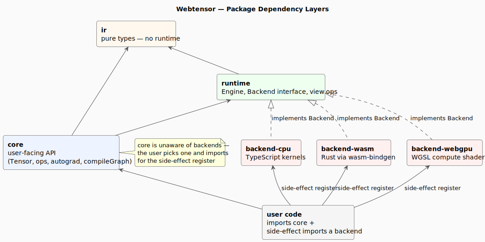

# 02 — Package Deep-Dive

Webtensor is a Bun workspace with six packages. The dependency graph is strictly layered: `backend-* → runtime → ir`, and `core → runtime → ir`. Backends never depend on `core`; `core` never depends on a specific backend.



For the boundary contract see [architecture.md](../architecture.md). This file is the field guide: what types live where, what the public surface is, what to avoid.

---

## `packages/ir`

**Role:** pure data types. Knows nothing about devices, tensors, backends, gradients, or compute.

**Key files:**

- [src/types.ts](../../packages/ir/src/types.ts) — `DType`, `AttributeValue`, `Value`, `Node`, `Graph`.
- [src/shape.ts](../../packages/ir/src/shape.ts) — `computeContiguousStrides(shape)` (single source of truth).

**Core types** (all from `types.ts`):

| Type             | Purpose                                                                                                 |
| ---------------- | ------------------------------------------------------------------------------------------------------- |
| `DType`          | `'float32' \| 'int32' \| 'bool'`. Re-exported by every other package.                                   |
| `Value`          | One typed edge in the graph: `{ name, shape, dtype, data?, producer?, consumers? }`.                    |
| `Node`           | One operation: `{ id, op, inputs, outputs, attributes? }`. `op` is a string (e.g. `'Add'`, `'MatMul'`). |
| `Graph`          | `{ nodes, values, inputs, outputs, initializers }`. Serializable.                                       |
| `AttributeValue` | Op-specific config — numbers, arrays, `ArrayBuffer` for embedded data.                                  |

**Public exports:** `VERSION`, all types above, `computeContiguousStrides`. See [src/index.ts](../../packages/ir/src/index.ts).

**Must not depend on:** anything. This is the leaf. Any backend or runtime utility that creeps in here is a layering violation.

---

## `packages/core`

**Role:** the user-facing API. Eager `Tensor` class, all op functions, autograd, `compileGraph()`.

**Key files:**

- [src/tensor.ts](../../packages/core/src/tensor.ts) — `Tensor` class and `backward()`.
- [src/ops.ts](../../packages/core/src/ops.ts) — every op function and its backward closure.
- [src/tensor_init.ts](../../packages/core/src/tensor_init.ts) — `tensor()`, `zeros()`, `ones()`.
- [src/compiler.ts](../../packages/core/src/compiler.ts) — `compileGraph(outputs)`.
- [src/shape.ts](../../packages/core/src/shape.ts) — `broadcastShapes`, `shapeSize`.
- [src/types.ts](../../packages/core/src/types.ts) — `OpContext<T>`, `Device`.

**The `Tensor` class** ([tensor.ts:45-70](../../packages/core/src/tensor.ts#L45-L70)) carries:

| Field          | What it is                                                                                                      |
| -------------- | --------------------------------------------------------------------------------------------------------------- |
| `id`           | Stable string like `t_42` from a module-level counter at [tensor.ts:34](../../packages/core/src/tensor.ts#L34). |
| `shape`        | `(number \| null)[]` — `null` reserved for dynamic dims (placeholders, not yet wired).                          |
| `strides`      | C-order by default, computed once at construction.                                                              |
| `size`         | Total element count.                                                                                            |
| `dtype`        | From `@webtensor/ir`.                                                                                           |
| `device`       | `'cpu' \| 'wasm' \| 'webgpu'` — picked by the user, propagates through ops.                                     |
| `requiresGrad` | Triggers backward closure capture and gradient accumulation.                                                    |
| `grad?`        | Set after `.backward()` — itself a `Tensor` representing an unevaluated gradient graph.                         |
| `_ctx?`        | The op context: `{ op, inputs, attributes?, backward? }`. Captures the closure for autograd.                    |

The class also exposes chaining methods (`.add()`, `.mul()`, `.transpose()`, …) that just call into the same op functions in `ops.ts`. See [tensor.ts:158-236](../../packages/core/src/tensor.ts#L158-L236).

**Must not depend on:** any specific backend. The eager API knows about `Device` strings only — the actual backend is selected at `Engine.create(device)` time and registered by side-effect import.

---

## `packages/runtime`

**Role:** owns execution. Defines the `Backend` contract, exposes `Engine`, dispatches view ops, manages tensor lifetime.

**Key files:**

- [src/engine.ts](../../packages/runtime/src/engine.ts) — `Engine`, `registerBackend`, topo sort, refcount GC.
- [src/backend.ts](../../packages/runtime/src/backend.ts) — `Backend` interface, `RuntimeTensor`, `RuntimeStorage`, stride utilities (`stridedIdx`, `broadcastStridesOf`, `isContiguous`, `getShapeSize`).
- [src/dtype.ts](../../packages/runtime/src/dtype.ts) — `bytesPerElement`, `typedArrayCtor`. All backends import from here.
- [src/views/](../../packages/runtime/src/views/) — `viewRegistry` plus one file per view op (`transpose`, `slice`, `permute`, `expand`, `squeeze`, `unsqueeze`).

**The `Backend` interface** ([backend.ts:116-122](../../packages/runtime/src/backend.ts#L116-L122)):

```ts
interface Backend {
  allocate(shape: (number | null)[], dtype: DType): RuntimeTensor;
  read(tensor: RuntimeTensor): Promise<ArrayBufferView>;
  write(tensor: RuntimeTensor, data: ArrayBufferView): void;
  execute(node: Node, inputs: RuntimeTensor[], outputs: RuntimeTensor[]): void | Promise<void>;
  dispose(tensor: RuntimeTensor): void;
}
```

That's it — five methods. `dispose()` must be a no-op when `tensor.isView` is true.

**The `Engine` class** holds:

- A `registry` (`Map<string, RuntimeTensor>`) — every value the engine has materialized.
- A reference to the chosen `Backend`.
- The `device` string (informational).

`Engine.create(device)` is async and looks up the backend from `backendRegistry`. Backends register themselves at module load time — that's why `import '@webtensor/backend-cpu'` is imported only for its side effect.

**Must not depend on:** `core`. The runtime can compute on a `Graph` without knowing how it was built. This separation is what enables future ONNX import — drop in a `Graph` from any source, evaluate it.

---

## `packages/backend-cpu`

**Role:** TypeScript reference backend. The correctness oracle for the other two.

**Key files:**

- [src/backend.ts](../../packages/backend-cpu/src/backend.ts) — `CPUBackend` class (~30 lines).
- [src/kernels/registry.ts](../../packages/backend-cpu/src/kernels/registry.ts) — kernel map.
- [src/kernels/utils.ts](../../packages/backend-cpu/src/kernels/utils.ts) — `CPUKernel` type, helpers like `buf()`.
- [src/kernels/binary/](../../packages/backend-cpu/src/kernels/binary/), `unary/`, `linalg/`, `memory/` — one file per op.
- [src/index.ts](../../packages/backend-cpu/src/index.ts) — `registerBackend('cpu', async () => new CPUBackend())`.

`CPUKernel` is `(node, inputs, outputs) => void`. Each kernel pulls the typed array via `buf()`, computes broadcast strides if needed, and iterates with `stridedIdx()`. See [03-backends-and-kernels.md](03-backends-and-kernels.md) for kernel anatomy.

**Must not depend on:** `core`.

---

## `packages/backend-wasm`

**Role:** Rust kernels compiled to WebAssembly via `wasm-pack`.

**Key files:**

- [src/backend.ts](../../packages/backend-wasm/src/backend.ts) — `WASMBackend` (async `create()`).
- [src/module.ts](../../packages/backend-wasm/src/module.ts) — wasm-pack 0.14 bundler-target loader (no default init export).
- [src/kernels/registry.ts](../../packages/backend-wasm/src/kernels/registry.ts) — kernel map.
- [src/kernels/utils.ts](../../packages/backend-wasm/src/kernels/utils.ts) — meta-buffer builders (`buildBinaryMetaData` 28 u32, `buildUnaryMetaData` 19 u32, matmul 9 u32).
- [rust/src/](../../packages/backend-wasm/rust/src/) — Rust source: `memory.rs` (alloc/free), `utils.rs` (`strided_idx`), `ops/` per kernel.
- [pkg/](../../packages/backend-wasm/pkg/) — generated by `wasm-pack`, included in `files`.

**Build:** `cd packages/backend-wasm && wasm-pack build rust --target bundler --out-dir ../pkg`. Required before any test that uses `WASMBackend`.

**Must not depend on:** `core`. May depend on `runtime` (for stride utils and `RuntimeTensor`).

---

## `packages/backend-webgpu`

**Role:** WGSL compute shaders dispatched via the WebGPU API.

**Key files:**

- [src/backend.ts](../../packages/backend-webgpu/src/backend.ts) — `WebGPUBackend` (async `create()`, pipeline cache).
- [src/kernels/utils.ts](../../packages/backend-webgpu/src/kernels/utils.ts) — `TensorMeta` packing (80-byte / 20-u32 uniform), `packMeta()`, `createMetaBuffer()`, `WebGPUKernel` interface.
- [src/kernels/registry.ts](../../packages/backend-webgpu/src/kernels/registry.ts) — kernel map.
- [src/kernels/\*_/_.wgsl](../../packages/backend-webgpu/src/kernels/) — one shader per op.
- [src/kernels/\*_/_.ts](../../packages/backend-webgpu/src/kernels/) — wrapper that compiles the shader and builds bind groups.

**Critical pitfall:** `meta` is a reserved WGSL keyword. Always name the uniform `u_meta` (or `u_meta_a` / `u_meta_b` for binary ops). Using `meta` causes silent pipeline failure with all-zero output. See [.claude/CLAUDE.md](../../.claude/CLAUDE.md).

**Must not depend on:** `core`. May depend on `runtime`.

---

## What lives in `tests/`

- [tests/ops/](../../tests/ops/) — per-op tests (one file per op).
- [tests/backend/](../../tests/backend/) — cross-backend parity (`consistency.test.ts`) and memory/GC tests.
- [tests/foundation/](../../tests/foundation/) — dtype round-trip, view ops, engine core.
- [tests/graph/](../../tests/graph/) — autograd, simple graph execution.
- [tests/helpers.ts](../../tests/helpers.ts) — shared helpers (`BACKENDS`, `runUnary`, `runBinary`, `expectClose`, etc.).

Tests run in **browser mode** via Vitest + Playwright + Chromium. Use `bun run test`, **not** `bun test` — the latter bypasses the browser config and WebGPU tests fail. See [07-contributor-guide.md](07-contributor-guide.md).

---

## Public API surface

For end users, the entry point is `@webtensor/core`. A typical app imports:

```ts
import { tensor, add, mul, /* ...other ops... */, compileGraph, Engine } from '@webtensor/core';
import '@webtensor/backend-cpu';     // pick one backend (or several)
import '@webtensor/backend-wasm';
import '@webtensor/backend-webgpu';
```

The backend imports are **side-effect imports** — they call `registerBackend(device, factory)` at module load. After that, `Engine.create('cpu' | 'wasm' | 'webgpu')` works.

---

## Layering rules to enforce in code review

| Layer       | May import                             | May NOT import                  |
| ----------- | -------------------------------------- | ------------------------------- |
| `ir`        | (nothing in this repo)                 | anything                        |
| `runtime`   | `ir`                                   | `core`, any `backend-*`         |
| `core`      | `ir`, `runtime`                        | any `backend-*`                 |
| `backend-*` | `ir`, `runtime`                        | `core`, any other `backend-*`   |
| user code   | `core`, `backend-*` (for registration) | `ir`, `runtime` (rarely needed) |

When reviewing a PR, the easiest catch is: did `core` start importing from a `backend-*` package? That's always wrong.

Continue with [03-backends-and-kernels.md](03-backends-and-kernels.md).
