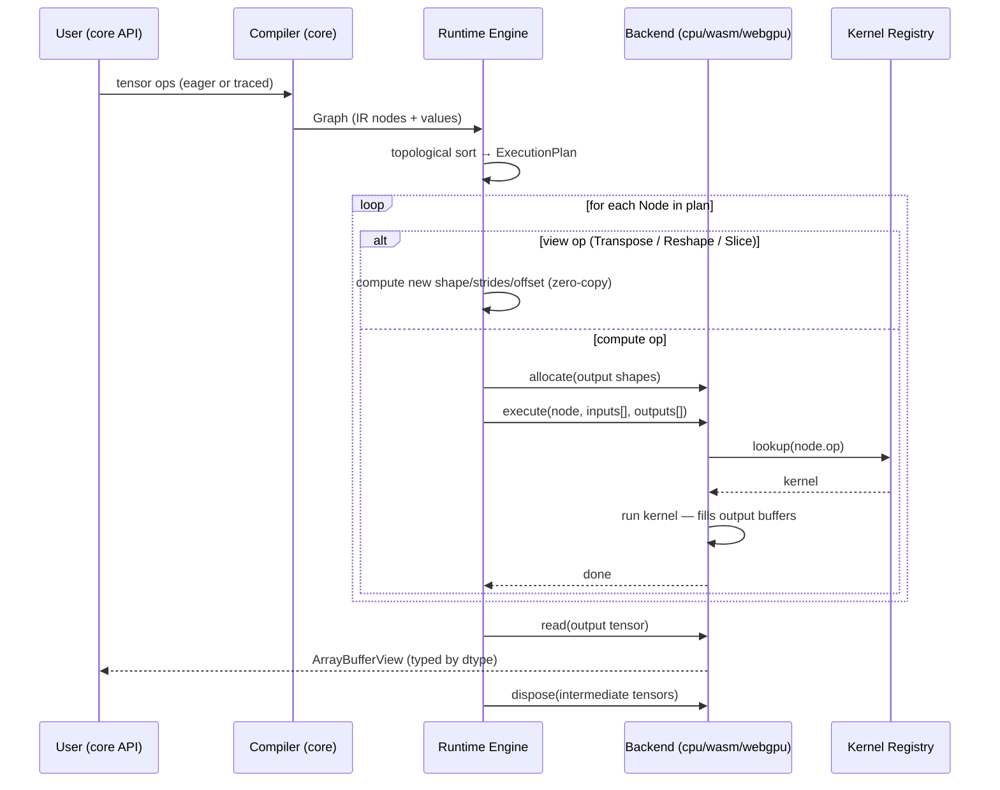
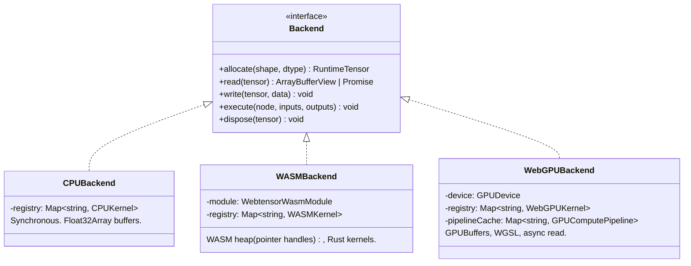
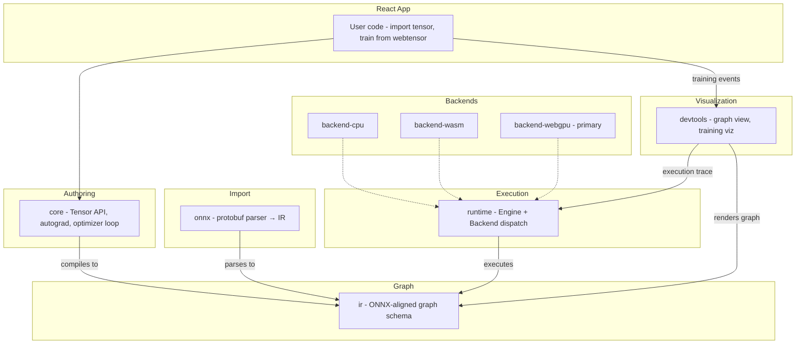

# Architecture

---

## Diagrams

### Execution Data Flow

See [diagrams/execution-flow.md](diagrams/execution-flow.md).



### Backend Internals

See [diagrams/backend-internals.md](diagrams/backend-internals.md).



### Target End-State

See [diagrams/target-architecture.md](diagrams/target-architecture.md).



---

## Package Boundaries

The boundary rule exists to keep each package independently testable and replaceable:

- `core` can build graphs but must not know how a backend stores memory — otherwise swapping backends would require changing user-facing code.
- `ir` can describe computation but must not know about autograd or devices — the same graph must be producible from hand-authored tensors and from an ONNX parser without either knowing about the other.
- `runtime` can execute graphs but must not contain op math — otherwise adding a backend would require touching the engine.
- `backends` can run kernels and own memory but must not define user-facing tensor semantics — user code imports from `core`, not from backend packages.

---

## Backend Contract

Two concepts must remain distinct:

```text
RuntimeTensor  = backend-owned memory handle (shape + strides + offset + dtype + storage)
Kernel         = implementation of one IR op for one backend
```

`Engine` plans execution order and calls kernels. It must not understand MatMul dimensions, WGSL workgroup geometry, or WASM pointer arithmetic. When `Engine.execute()` receives a node, it allocates outputs from the backend and delegates everything else. If `Engine` is growing op-specific logic, that logic belongs in the backend.

View ops (Transpose, Reshape, Slice, Unsqueeze, Squeeze, Permute, Expand) are a special case: they are handled entirely inside `Engine` by computing new shape/strides/offset metadata without any backend call or allocation. Reshape auto-copies non-contiguous tensors to match PyTorch semantics; the strict alternative `view()` throws on non-contiguous input instead.

---

## Kernel Registry Pattern

Each backend owns a `Map<string, KernelFn>` keyed by `node.op`. This replaces growing `switch` statements in `execute()` and gives each backend one canonical place to answer:

- Which ops do I support?
- How does this op map to my implementation?
- What backend-specific state does this op need?

Registry files:

- `packages/backend-cpu/src/kernels/registry.ts`
- `packages/backend-wasm/src/kernels/registry.ts`
- `packages/backend-webgpu/src/kernels/registry.ts`

---

## Strided Tensor Model

All three backends use the same strided tensor model: every `RuntimeTensor` carries `shape`, `strides`, and `offset` alongside the storage buffer. This enables zero-copy views for Transpose, Reshape, Slice, Unsqueeze, Squeeze, Permute, and Expand — the view just gets new metadata pointing into the same storage.

Kernels are responsible for handling arbitrary strides. CPU and WASM kernels iterate using the `stridedIdx` utility. WebGPU kernels receive a `TensorMeta` uniform buffer (rank, offset, shape, strides packed as two `array<vec4<u32>, 2>`) and decompose the flat index inside the WGSL shader.

Broadcasting is implemented via stride-0: a dimension that is broadcast (size 1 in the input, size > 1 in the output) gets stride 0, so repeated reads return the same element without copying.

---

## Engine Execution Model

`Engine.evaluate(graph)` is always async — it awaits each `backend.execute()` call. The `Backend.execute()` interface returns `void | Promise<void>`: CPU and WASM return synchronously, WebGPU returns `device.queue.onSubmittedWorkDone()`. The engine always awaits, so callers get correct behavior on all backends without special-casing.

`Engine` can be constructed two ways:

- **Direct:** `new Engine(backend)` — caller creates the backend themselves.
- **Device dispatch:** `await Engine.create('cpu' | 'wasm' | 'webgpu')` — looks up a registered backend factory and creates the engine. Backends self-register by calling `registerBackend(device, factory)` when their package is imported.

---

## DType Infrastructure

`DType` is defined once in `packages/ir/src/types.ts` and re-exported by all packages:

```ts
type DType = 'float32' | 'int32' | 'bool';
```

Only `float32` has full kernel support across all three backends. `int32` and `bool` can be allocated and round-tripped (write → read) but have no op kernels yet.

Dtype utilities live in `packages/runtime/src/dtype.ts`:

- `bytesPerElement(dtype)` — byte size per element (4, 4, 1)
- `typedArrayCtor(dtype)` — returns the JS TypedArray constructor (`Float32Array`, `Int32Array`, `Uint8Array`)
- `copyBuffer(dst, src)` — byte-level copy between TypedArrays (avoids TS union `.set()` incompatibility)
- `TypedArray` — union type `Float32Array | Int32Array | Uint8Array`, imported by all backends and tests

All three backends use these utilities for allocation and buffer sizing instead of hardcoded `Float32Array` / `* 4`.

---

## WASM Backend: Memory Model

Tensor memory lives in the WASM heap, not in JS. The lifecycle:

```text
allocate()  →  module.alloc_f32(size)         returns a pointer; wraps in WasmTensorHandle
write()     →  copies JS TypedArray into WASM heap via module.memory.buffer view
execute()   →  calls Rust kernel with raw pointers (no JS/WASM data crossing per element)
read()      →  copies WASM heap slice back into a new JS TypedArray (dtype-aware)
dispose()   →  module.free_f32(ptr, elements)  frees the WASM allocation
```

Tensors do not cross the JS/WASM boundary on every kernel call. The `_raw` suffix on Rust functions (e.g., `add_raw`) marks the pointer-based variants used at runtime.

`packages/backend-wasm/pkg/` is build output from `wasm-pack` and must not be imported directly by kernel code. `packages/backend-wasm/src/module.ts` is the only file that imports from `pkg/` — all kernel code goes through `module.ts`.

---

## Testing Strategy

CPU is the correctness oracle. Every op must pass:

```text
same graph  →  CPU result
same graph  →  WASM result     (must match CPU within 1e-5)
same graph  →  WebGPU result   (must match CPU within 1e-5)
```

Tests run in Vitest browser mode (Playwright, Chromium). Do not use `bun test` directly — use `bun run test`, which invokes Vitest with the correct browser environment configuration.
