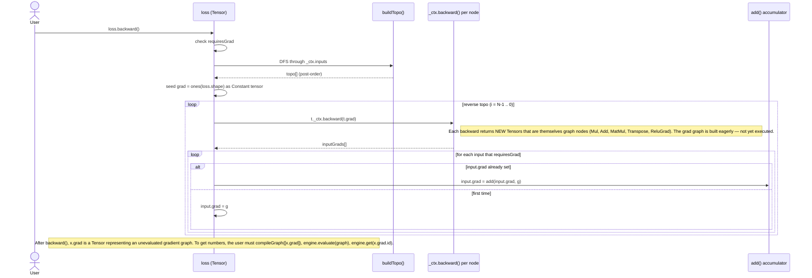

# Autograd Backward Pass

`.backward()` builds a gradient graph eagerly. No compute happens until you `compileGraph` and `engine.evaluate` it.

```mermaid
sequenceDiagram
    actor User
    participant Loss as loss (Tensor)
    participant Topo as buildTopo()
    participant Bwd as _ctx.backward() per node
    participant Acc as add() accumulator

    User->>Loss: loss.backward()
    Loss->>Loss: check requiresGrad
    Loss->>Topo: DFS through _ctx.inputs
    Topo-->>Loss: topo[] (post-order)
    Loss->>Loss: seed grad = ones(loss.shape) as Constant tensor

    loop reverse topo (i = N-1 .. 0)
        Loss->>Bwd: t._ctx.backward(t.grad)
        Note right of Bwd: Each backward returns NEW Tensors that are themselves graph nodes (Mul, Add, MatMul, Transpose, ReluGrad). The grad graph is built eagerly — not yet executed.
        Bwd-->>Loss: inputGrads[]
        loop for each input that requiresGrad
            alt input.grad already set
                Loss->>Acc: input.grad = add(input.grad, g)
            else first time
                Loss->>Loss: input.grad = g
            end
        end
    end

    Note over Loss: After backward(), x.grad is a Tensor representing an unevaluated gradient graph. To get numbers, the user must compileGraph([x.grad]), engine.evaluate(graph), engine.get(x.grad.id).
```
