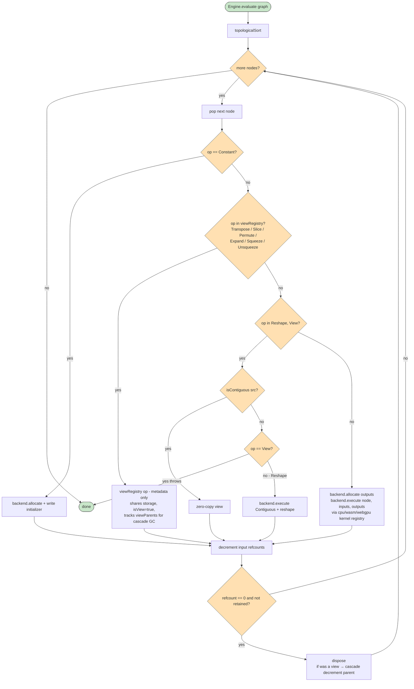

# Engine Dispatch

Three fast paths plus the kernel call.

```mermaid
flowchart TD
    Start([Engine.evaluate graph]) --> Topo[topologicalSort]
    Topo --> Loop{more nodes?}
    Loop -->|no| End([done])
    Loop -->|yes| Pop[pop next node]

    Pop --> IsConst{op == Constant?}
    IsConst -->|yes| ConstAlloc[backend.allocate + write initializer]
    ConstAlloc --> Refs

    IsConst -->|no| IsView{op in viewRegistry?<br/>Transpose / Slice / Permute /<br/>Expand / Squeeze / Unsqueeze}
    IsView -->|yes| ViewMeta[viewRegistry op - metadata only<br/>shares storage, isView=true,<br/>tracks viewParents for cascade GC]
    ViewMeta --> Refs

    IsView -->|no| IsReshape{op in Reshape, View?}
    IsReshape -->|yes| Cont{isContiguous src?}
    Cont -->|yes| ZeroCopy[zero-copy view]
    Cont -->|no| IsViewOp{op == View?}
    IsViewOp -->|yes throws| End
    IsViewOp -->|no - Reshape| Contig[backend.execute Contiguous + reshape]
    ZeroCopy --> Refs
    Contig --> Refs

    IsReshape -->|no| Kernel[backend.allocate outputs<br/>backend.execute node, inputs, outputs<br/>via cpu/wasm/webgpu kernel registry]
    Kernel --> Refs

    Refs[decrement input refcounts] --> Zero{refcount == 0 and not retained?}
    Zero -->|yes| Dispose[dispose<br/>if was a view → cascade decrement parent]
    Zero -->|no| Loop
    Dispose --> Loop

    classDef terminal fill:#C8E6C9,stroke:#555;
    classDef decision fill:#FFE0B2,stroke:#555;
    class Start,End terminal;
    class Loop,IsConst,IsView,IsReshape,Cont,IsViewOp,Zero decision;
```
