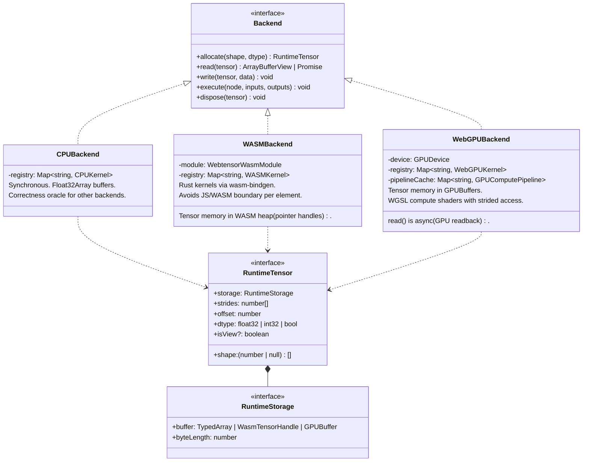

# Backend Internals

The `Backend` interface and its three implementations.

```mermaid
classDiagram
    class Backend {
        <<interface>>
        +allocate(shape, dtype) RuntimeTensor
        +read(tensor) ArrayBufferView | Promise
        +write(tensor, data) void
        +execute(node, inputs, outputs) void
        +dispose(tensor) void
    }

    class RuntimeStorage {
        <<interface>>
        +buffer: TypedArray | WasmTensorHandle | GPUBuffer
        +byteLength: number
    }

    class RuntimeTensor {
        <<interface>>
        +storage: RuntimeStorage
        +shape: (number | null)[]
        +strides: number[]
        +offset: number
        +dtype: float32 | int32 | bool
        +isView?: boolean
    }

    class CPUBackend {
        -registry: Map~string, CPUKernel~
        Synchronous. Float32Array buffers.
        Correctness oracle for other backends.
    }

    class WASMBackend {
        -module: WebtensorWasmModule
        -registry: Map~string, WASMKernel~
        Tensor memory in WASM heap (pointer handles).
        Rust kernels via wasm-bindgen.
        Avoids JS/WASM boundary per element.
    }

    class WebGPUBackend {
        -device: GPUDevice
        -registry: Map~string, WebGPUKernel~
        -pipelineCache: Map~string, GPUComputePipeline~
        Tensor memory in GPUBuffers.
        WGSL compute shaders with strided access.
        read() is async (GPU readback).
    }

    RuntimeTensor *-- RuntimeStorage
    Backend <|.. CPUBackend
    Backend <|.. WASMBackend
    Backend <|.. WebGPUBackend
    CPUBackend ..> RuntimeTensor
    WASMBackend ..> RuntimeTensor
    WebGPUBackend ..> RuntimeTensor
```
