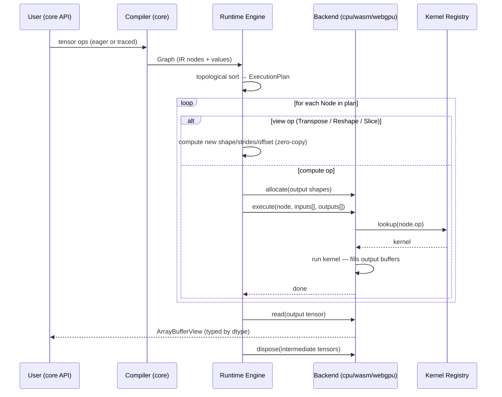

# Execution Flow

Compiler → engine → backend → kernel registry.

```mermaid
sequenceDiagram
    participant User as User (core API)
    participant Compiler as Compiler (core)
    participant Engine as Runtime Engine
    participant Backend as Backend (cpu/wasm/webgpu)
    participant Registry as Kernel Registry

    User->>Compiler: tensor ops (eager or traced)
    Compiler->>Engine: Graph (IR nodes + values)
    Engine->>Engine: topological sort → ExecutionPlan

    loop for each Node in plan
        alt view op (Transpose / Reshape / Slice)
            Engine->>Engine: compute new shape/strides/offset (zero-copy)
        else compute op
            Engine->>Backend: allocate(output shapes)
            Engine->>Backend: execute(node, inputs[], outputs[])
            Backend->>Registry: lookup(node.op)
            Registry-->>Backend: kernel
            Backend->>Backend: run kernel — fills output buffers
            Backend-->>Engine: done
        end
    end

    Engine->>Backend: read(output tensor)
    Backend-->>User: ArrayBufferView (typed by dtype)
    Engine->>Backend: dispose(intermediate tensors)
```
