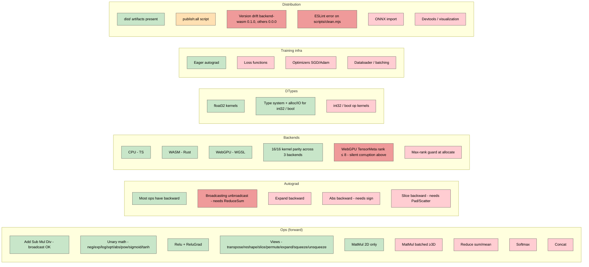

# Gap Map

Visual matrix of what works (green), partial (orange), missing (light red), and active bugs (dark red).

```mermaid
flowchart LR
    subgraph Ops["Ops (forward)"]
        O1[Add Sub Mul Div - broadcast OK]:::done
        O2[Unary math - neg/exp/log/sqrt/abs/pow/sigmoid/tanh]:::done
        O3[Relu + ReluGrad]:::done
        O4[Views - transpose/reshape/slice/permute/expand/squeeze/unsqueeze]:::done
        O5[MatMul 2D only]:::done
        O6[MatMul batched ≥3D]:::missing
        O7[Reduce sum/mean]:::missing
        O8[Softmax]:::missing
        O9[Concat]:::missing
    end

    subgraph Auto["Autograd"]
        A1[Most ops have backward]:::done
        A2[Broadcasting unbroadcast - needs ReduceSum]:::bug
        A3[Expand backward]:::missing
        A4[Abs backward - needs sign]:::missing
        A5[Slice backward - needs Pad/Scatter]:::missing
    end

    subgraph Backends["Backends"]
        B1[CPU - TS]:::done
        B2[WASM - Rust]:::done
        B3[WebGPU - WGSL]:::done
        B4[16/16 kernel parity across 3 backends]:::done
        B5[WebGPU TensorMeta rank ≤ 8 - silent corruption above]:::bug
        B6[Max-rank guard at allocate]:::missing
    end

    subgraph DT["DTypes"]
        D1[float32 kernels]:::done
        D2[Type system + alloc/IO for int32 / bool]:::done
        D3[int32 / bool op kernels]:::missing
    end

    subgraph Train["Training infra"]
        T1[Eager autograd]:::done
        T2[Loss functions]:::missing
        T3[Optimizers SGD/Adam]:::missing
        T4[Dataloader / batching]:::missing
    end

    subgraph Dist["Distribution"]
        Di1[dist/ artifacts present]:::done
        Di2[publish:all script]:::partial
        Di3[Version drift backend-wasm 0.1.0, others 0.0.0]:::bug
        Di4[ESLint error on scripts/clean.mjs]:::bug
        Di5[ONNX import]:::missing
        Di6[Devtools / visualization]:::missing
    end

    classDef done fill:#C8E6C9,stroke:#555,color:#000;
    classDef partial fill:#FFE0B2,stroke:#555,color:#000;
    classDef missing fill:#FFCDD2,stroke:#555,color:#000;
    classDef bug fill:#EF9A9A,stroke:#555,color:#000;
```
