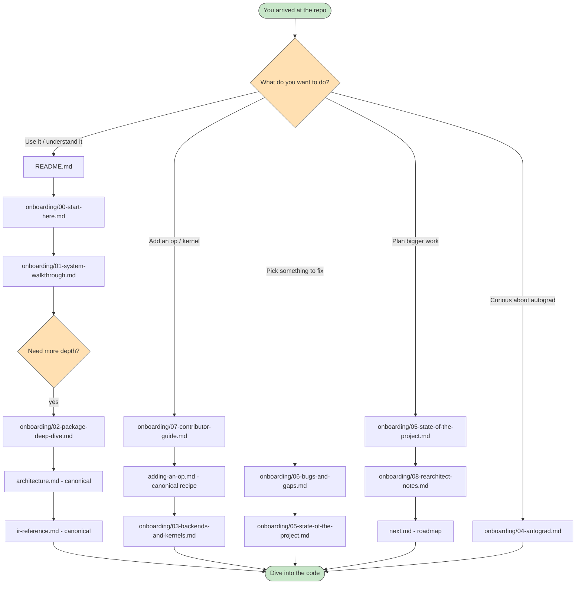

# Onboarding Flow

Reading-order map: which doc to open for which goal.

```mermaid
flowchart TD
    Start([You arrived at the repo]) --> Q{What do you want to do?}

    Q -->|Use it / understand it| U1[README.md]
    U1 --> U2[onboarding/00-start-here.md]
    U2 --> U3[onboarding/01-system-walkthrough.md]
    U3 --> U4{Need more depth?}
    U4 -->|yes| U5[onboarding/02-package-deep-dive.md]
    U5 --> U6[architecture.md - canonical]
    U6 --> U7[ir-reference.md - canonical]

    Q -->|Add an op / kernel| C1[onboarding/07-contributor-guide.md]
    C1 --> C2[adding-an-op.md - canonical recipe]
    C2 --> C3[onboarding/03-backends-and-kernels.md]

    Q -->|Pick something to fix| F1[onboarding/06-bugs-and-gaps.md]
    F1 --> F2[onboarding/05-state-of-the-project.md]

    Q -->|Plan bigger work| R1[onboarding/05-state-of-the-project.md]
    R1 --> R2[onboarding/08-rearchitect-notes.md]
    R2 --> R3[next.md - roadmap]

    Q -->|Curious about autograd| A1[onboarding/04-autograd.md]

    U7 --> End([Dive into the code])
    C3 --> End
    F2 --> End
    R3 --> End
    A1 --> End

    classDef question fill:#FFE0B2,stroke:#555;
    classDef terminal fill:#C8E6C9,stroke:#555;
    class Q,U4 question;
    class Start,End terminal;
```
