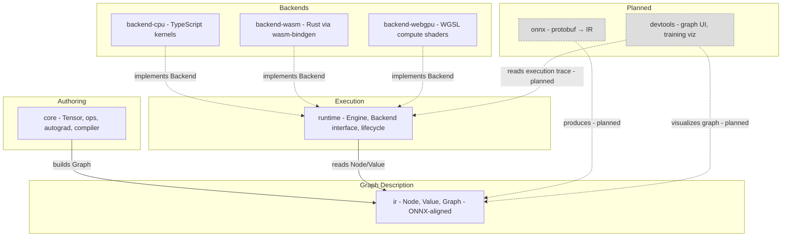

# Package Map

Six published packages plus two planned. Arrows show dependency direction.

```mermaid
flowchart TD
    subgraph Authoring["Authoring"]
        core[core - Tensor, ops, autograd, compiler]
    end

    subgraph Graph["Graph Description"]
        ir[ir - Node, Value, Graph - ONNX-aligned]
    end

    subgraph Execution["Execution"]
        runtime[runtime - Engine, Backend interface, lifecycle]
    end

    subgraph Backends["Backends"]
        cpu[backend-cpu - TypeScript kernels]
        wasm[backend-wasm - Rust via wasm-bindgen]
        webgpu[backend-webgpu - WGSL compute shaders]
    end

    subgraph Planned["Planned"]
        onnx[onnx - protobuf → IR]:::planned
        devtools[devtools - graph UI, training viz]:::planned
    end

    core -->|builds Graph| ir
    runtime -->|reads Node/Value| ir
    cpu -.->|implements Backend| runtime
    wasm -.->|implements Backend| runtime
    webgpu -.->|implements Backend| runtime

    onnx -.->|produces - planned| ir
    devtools -.->|visualizes graph - planned| ir
    devtools -.->|reads execution trace - planned| runtime

    classDef planned fill:#DDDDDD,stroke:#888,stroke-dasharray: 4 2;
```
