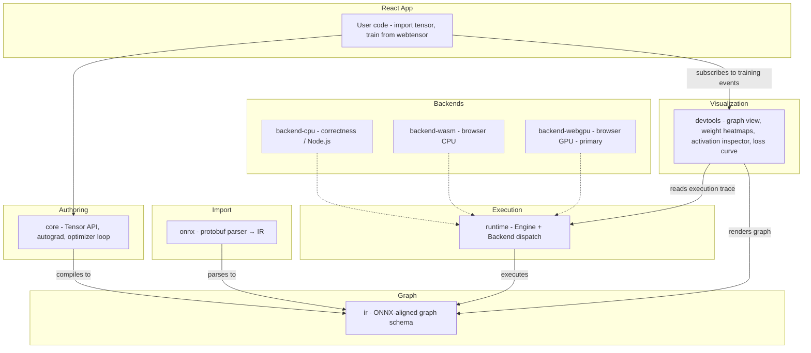

# Target Architecture

Where webtensor wants to land — including planned `onnx` import and `devtools` packages.

```mermaid
flowchart TD
    subgraph App["React App"]
        usercode[User code - import tensor, train from webtensor]
    end

    subgraph Authoring["Authoring"]
        core[core - Tensor API, autograd, optimizer loop]
    end

    subgraph Import["Import"]
        onnx[onnx - protobuf parser → IR]
    end

    subgraph Graph["Graph"]
        ir[ir - ONNX-aligned graph schema]
    end

    subgraph Execution["Execution"]
        runtime[runtime - Engine + Backend dispatch]
    end

    subgraph Backends["Backends"]
        cpu[backend-cpu - correctness / Node.js]
        wasm[backend-wasm - browser CPU]
        webgpu[backend-webgpu - browser GPU - primary]
    end

    subgraph Vis["Visualization"]
        devtools[devtools - graph view, weight heatmaps, activation inspector, loss curve]
    end

    usercode --> core
    usercode -->|subscribes to training events| devtools
    core -->|compiles to| ir
    onnx -->|parses to| ir
    runtime -->|executes| ir
    cpu -.-> runtime
    wasm -.-> runtime
    webgpu -.-> runtime
    devtools -->|reads execution trace| runtime
    devtools -->|renders graph| ir
```
