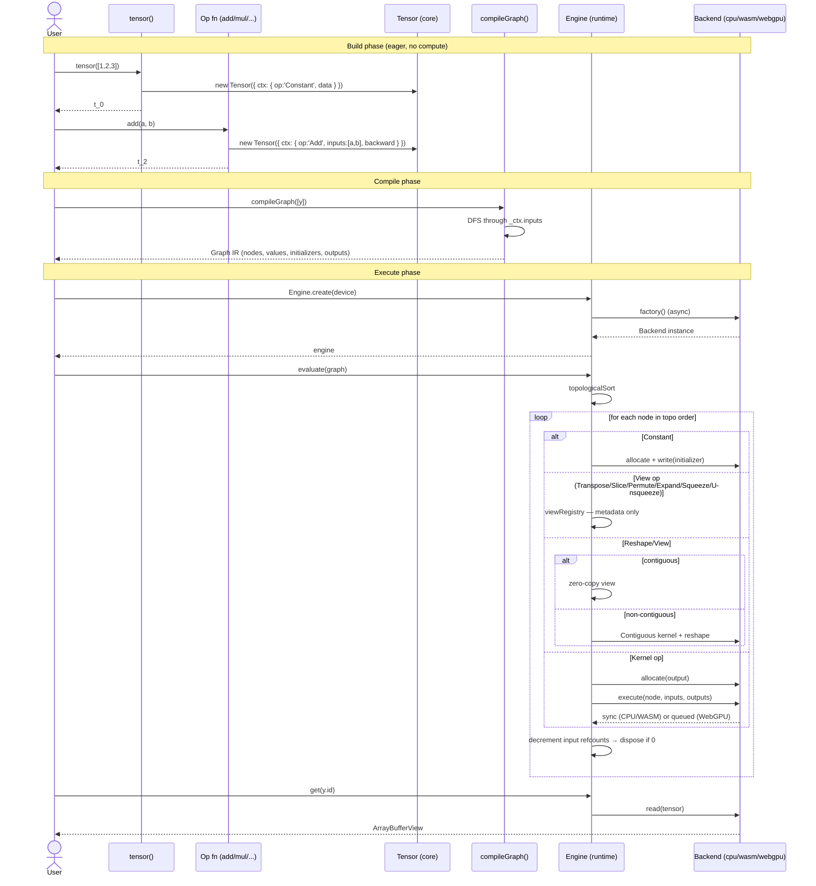

# Tensor Lifecycle

From user code to result — build, compile, execute, read.

```mermaid
sequenceDiagram
    actor User
    participant Init as tensor()
    participant Op as Op fn (add/mul/...)
    participant T as Tensor (core)
    participant Compile as compileGraph()
    participant Engine as Engine (runtime)
    participant Backend as Backend (cpu/wasm/webgpu)

    Note over User,Backend: Build phase (eager, no compute)
    User->>Init: tensor([1,2,3])
    Init->>T: new Tensor({ ctx: { op:'Constant', data } })
    Init-->>User: t_0
    User->>Op: add(a, b)
    Op->>T: new Tensor({ ctx: { op:'Add', inputs:[a,b], backward } })
    Op-->>User: t_2

    Note over User,Backend: Compile phase
    User->>Compile: compileGraph([y])
    Compile->>Compile: DFS through _ctx.inputs
    Compile-->>User: Graph IR (nodes, values, initializers, outputs)

    Note over User,Backend: Execute phase
    User->>Engine: Engine.create(device)
    Engine->>Backend: factory()  (async)
    Backend-->>Engine: Backend instance
    Engine-->>User: engine

    User->>Engine: evaluate(graph)
    Engine->>Engine: topologicalSort
    loop for each node in topo order
        alt Constant
            Engine->>Backend: allocate + write(initializer)
        else View op (Transpose/Slice/Permute/Expand/Squeeze/Unsqueeze)
            Engine->>Engine: viewRegistry — metadata only
        else Reshape/View
            alt contiguous
                Engine->>Engine: zero-copy view
            else non-contiguous
                Engine->>Backend: Contiguous kernel + reshape
            end
        else Kernel op
            Engine->>Backend: allocate(output)
            Engine->>Backend: execute(node, inputs, outputs)
            Backend-->>Engine: sync (CPU/WASM) or queued (WebGPU)
        end
        Engine->>Engine: decrement input refcounts → dispose if 0
    end

    User->>Engine: get(y.id)
    Engine->>Backend: read(tensor)
    Backend-->>User: ArrayBufferView
```
