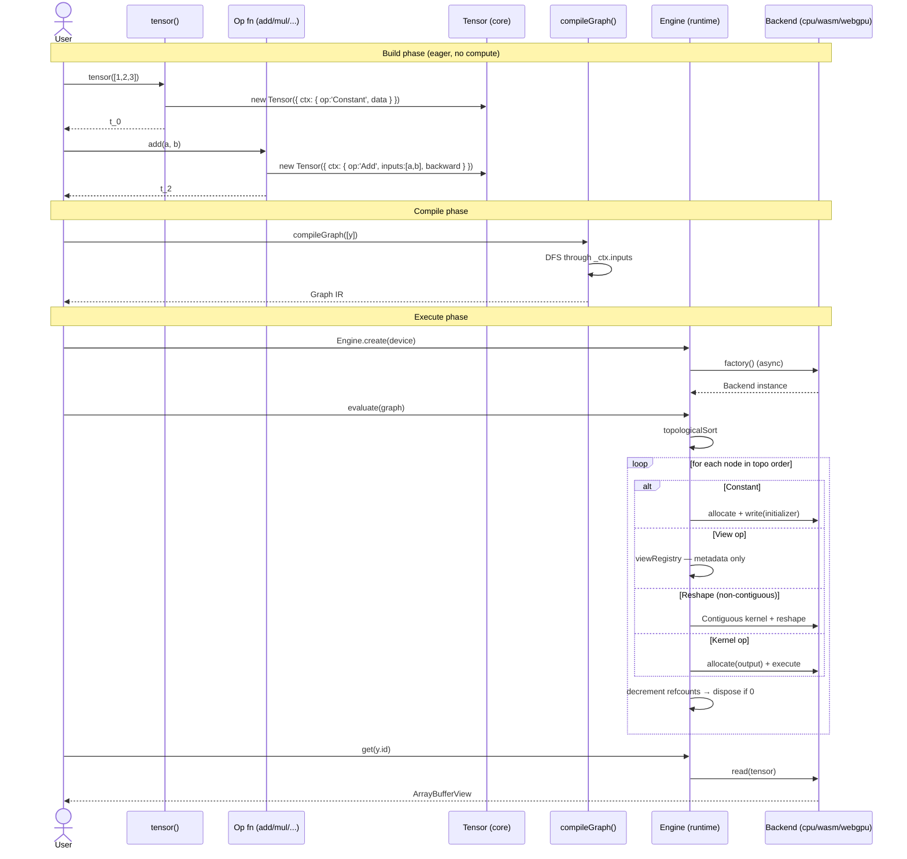
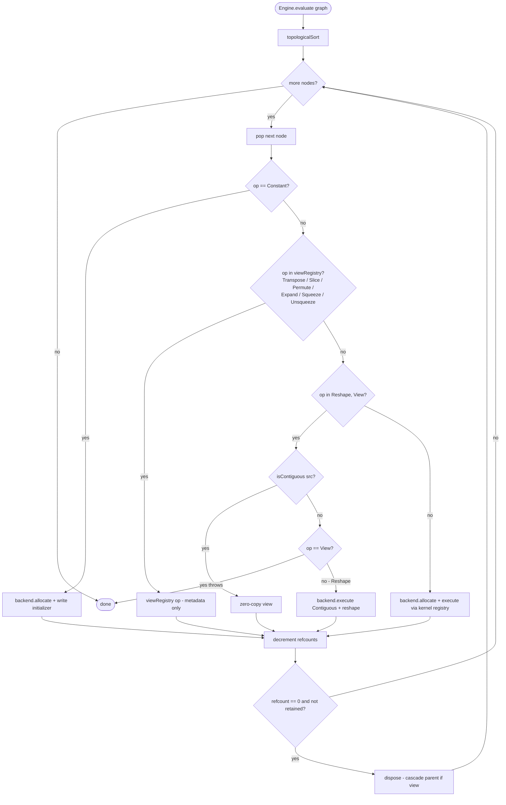

# 01 — System Walkthrough

End-to-end tour of how a tensor expression becomes a number. We follow one concrete example through every layer.

See [diagrams/tensor-lifecycle.md](../diagrams/tensor-lifecycle.md).



---

## The four phases

Every webtensor program goes through the same four phases:

1. **Build** — eager ops construct a graph of `Tensor` objects (no compute happens).
2. **Compile** — `compileGraph(outputs)` traces the graph into a pure IR (`Graph` from `@webtensor/ir`).
3. **Execute** — `Engine.evaluate(graph)` topologically dispatches to a `Backend`.
4. **Read** — `engine.get(id)` returns an `ArrayBufferView` with the result.

You can stop after compile (the IR is serializable) or after execute (read multiple outputs). The eager ops never touch a backend.

---

## Worked example — `c = (a + b) * 2`

```ts
import { tensor, add, mul, compileGraph, Engine } from '@webtensor/core';
import '@webtensor/backend-cpu'; // side-effect: registerBackend('cpu', ...)

const a = tensor([1, 2, 3]); // t_0
const b = tensor([4, 5, 6]); // t_1
const two = tensor([2]); // t_2
const sum = add(a, b); // t_3   (Add node)
const c = mul(sum, two); // t_4   (Mul node)

const graph = compileGraph([c]);
const engine = await Engine.create('cpu');
await engine.evaluate(graph);
const out = await engine.get(c.id); // Float32Array([10, 14, 18])
```

What happens at each phase:

### Phase 1 — Build (eager)

`tensor(...)` is in [packages/core/src/tensor_init.ts](../../packages/core/src/tensor_init.ts). It allocates a fresh `Tensor` whose `_ctx` is `{ op: 'Constant', inputs: [], attributes: { data } }`. The `id` comes from a module-level counter ([tensor.ts:34](../../packages/core/src/tensor.ts#L34) → `tensorIdCounter`).

`add(a, b)` is in [packages/core/src/ops.ts:5-28](../../packages/core/src/ops.ts#L5-L28). It computes the broadcast output shape and returns a new `Tensor` whose `_ctx` is:

```ts
{
  op: 'Add',
  inputs: [a, b],
  backward: (grad) => [grad, grad],   // captured closure
}
```

No memory is allocated, no kernel runs. The whole graph lives as cross-references between `Tensor._ctx.inputs`.

### Phase 2 — Compile

[`compileGraph(outputs)`](../../packages/core/src/compiler.ts#L23) walks the graph by DFS from each output, recursing into `t._ctx.inputs`:

- Each visited `Tensor` becomes a `Value` (`{ name, shape, dtype }`).
- Each `_ctx` becomes a `Node` (`{ id, op, inputs[], outputs[], attributes? }`).
- `Constant` nodes are tagged as **initializers** (their data is embedded in the graph and retained for the engine's lifetime).
- After the walk, a second pass fills in `value.consumers[]` for every input — the engine uses these to refcount.

Critical design rule from [compiler.ts:17-21](../../packages/core/src/compiler.ts#L17-L21): `requiresGrad` does **not** classify a value as initializer or input. Provenance does — `Constant` op = initializer, no producer = leaf (also retained), everything else is an intermediate.

For our example, the IR looks like:

```text
nodes:        [Constant t_0, Constant t_1, Constant t_2, Add t_3, Mul t_4]
values:       { t_0..t_4: { shape, dtype, consumers } }
initializers: [t_0, t_1, t_2]
outputs:      [t_4]
```

### Phase 3 — Execute

[`Engine.create(device)`](../../packages/runtime/src/engine.ts#L30) looks up a backend factory in `backendRegistry` (populated by side-effect imports — see [engine.ts:7-11](../../packages/runtime/src/engine.ts#L7-L11) and each backend's `index.ts`).

[`Engine.evaluate(graph)`](../../packages/runtime/src/engine.ts#L61) does a topological sort ([engine.ts:194](../../packages/runtime/src/engine.ts#L194)) then walks nodes in order. For each node it picks one of four paths:

See [diagrams/backend-dispatch.md](../diagrams/backend-dispatch.md).



| Path                         | Trigger                          | What happens                                                                                                                                                                                                                          |
| ---------------------------- | -------------------------------- | ------------------------------------------------------------------------------------------------------------------------------------------------------------------------------------------------------------------------------------- |
| **Constant load**            | `node.op === 'Constant'`         | `engine.set()` allocates and writes the embedded data via the backend.                                                                                                                                                                |
| **View fast-path**           | `node.op` is in `viewRegistry`   | A `ViewFn` returns a new `RuntimeTensor` sharing storage — no kernel call, no allocation. See [packages/runtime/src/views/](../../packages/runtime/src/views/) for `transpose`, `slice`, `permute`, `expand`, `squeeze`, `unsqueeze`. |
| **Reshape contiguity check** | `node.op` is `Reshape` or `View` | If contiguous, zero-copy (just remap shape & strides). If non-contiguous, `Reshape` auto-allocates and runs a `Contiguous` copy ([engine.ts:148-173](../../packages/runtime/src/engine.ts#L148-L173)); `View` throws.                 |
| **Kernel dispatch**          | anything else                    | `backend.allocate()` for each output, then `backend.execute(node, inputs, outputs)`. Backend looks up the kernel in its registry.                                                                                                     |

After every node, `decrementRef()` ([engine.ts:74-85](../../packages/runtime/src/engine.ts#L74-L85)) decrements each input's refcount. When it hits zero and the value isn't in the `retained` set (initializers + inputs + outputs), the tensor is disposed. If that tensor was a view, the cascade also decrements the parent's refcount — so a transpose chain frees correctly.

### Phase 4 — Read

[`engine.get(id)`](../../packages/runtime/src/engine.ts#L47) calls `backend.read(tensor)`. CPU returns the underlying `Float32Array` synchronously (wrapped in a Promise). WebGPU copies device → host via a staging buffer. WASM returns a typed-array view into the WASM linear memory.

---

## The strided tensor model

Every `RuntimeTensor` ([backend.ts:25-37](../../packages/runtime/src/backend.ts#L25-L37)) carries:

- `storage` — the actual buffer (TypedArray / GPUBuffer / WASM handle), shared across views.
- `shape`, `strides`, `offset` — independent of storage, like PyTorch.
- `dtype` — `'float32' | 'int32' | 'bool'`.
- `isView?` — when `true`, `backend.dispose()` is a no-op (the parent owns the storage).

The runtime exports three utilities all backends import from a single source ([backend.ts:62-112](../../packages/runtime/src/backend.ts#L62-L112)):

- `stridedIdx(shape, strides, offset, flatIdx)` — the workhorse. Decomposes a flat iteration index into per-axis coordinates, dots them with strides, adds offset. Used by every CPU and WASM kernel for arbitrary layouts.
- `broadcastStridesOf(outShape, inShape, inStrides)` — produces strides where broadcast axes (size-1 in the input) become stride-0, so repeated reads return the same element without copying.
- `isContiguous(shape, strides, offset)` — true iff `offset === 0` and strides are exactly the row-major values for the shape.

This is the foundation that lets `transpose()`, `slice()`, `expand()`, etc. be **zero-copy** — they just produce new metadata over the same storage.

---

## Reference counting and view cleanup

The engine builds a `refCounts` map from `value.consumers.length` ([engine.ts:66-70](../../packages/runtime/src/engine.ts#L66-L70)) and a `retained` set from outputs + inputs + initializers ([engine.ts:64](../../packages/runtime/src/engine.ts#L64)). After every kernel execution, each input gets a `decrementRef`. Views are tracked separately in `viewParents` so that disposing a view also nudges its parent — a chain like `a → permute(a) → slice(...)` frees the slice first, the permute second, then `a` if nothing else uses it.

This is why `backend.dispose(tensor)` must be a no-op for views — the parent owns the storage. See the CPU implementation at [packages/backend-cpu/src/backend.ts](../../packages/backend-cpu/src/backend.ts) for the simple case.

---

## Sync vs async execution

`Backend.execute()` returns `void | Promise<void>` ([backend.ts:120](../../packages/runtime/src/backend.ts#L120)).

- **CPU and WASM** return synchronously — the kernel finishes before `execute()` returns.
- **WebGPU** queues work on the GPU and returns immediately; you only know it's done when you call `device.queue.onSubmittedWorkDone()` (the engine awaits it implicitly via `engine.evaluateAsync` patterns and inside `read()`).

`engine.evaluate(graph)` is `async` and `await`s `backend.execute()` uniformly ([engine.ts:186](../../packages/runtime/src/engine.ts#L186)). For training loops on WebGPU you must keep awaiting evaluate so the queue drains correctly between iterations.

---

## Where to go from here

- **[02-package-deep-dive.md](02-package-deep-dive.md)** — what each package owns and what it must not depend on.
- **[03-backends-and-kernels.md](03-backends-and-kernels.md)** — the three backends in detail.
- **[04-autograd.md](04-autograd.md)** — backward pass; how `_ctx.backward` builds the gradient graph.
