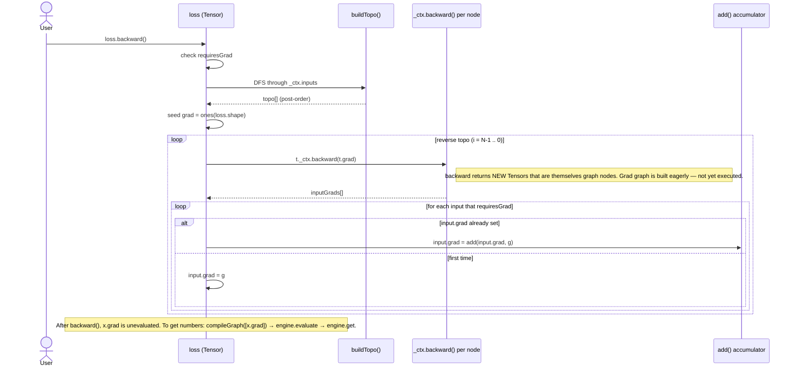

# 04 — Autograd

Webtensor uses **eager, dynamic autograd**. Each forward op captures a backward closure inside `Tensor._ctx`. Calling `.backward()` walks the captured graph in reverse and accumulates gradients by **constructing more graph nodes** — the gradient itself is a deferred computation.

See [diagrams/autograd-backward.md](../diagrams/autograd-backward.md).



---

## The mechanism

### `_ctx` — the captured closure

Every op function in [ops.ts](../../packages/core/src/ops.ts) builds a `Tensor` whose `_ctx` is:

```ts
{
  op: 'Mul',                  // name in the IR
  inputs: [a, b],             // upstream Tensor refs
  attributes?: { ... },       // op-specific config (e.g. `exponent` for Pow)
  backward?: (grad) => Tensor[],  // closure capturing a, b for the gradient computation
}
```

Backward is **optional**. Ops without a backward closure (`Abs`, `Slice`, `Expand`) silently skip in the backward pass — gradients won't reach inputs through them. See the missing-gradients table below.

### `Tensor.backward()`

[tensor.ts:72-131](../../packages/core/src/tensor.ts#L72-L131):

1. Throw if `requiresGrad` is false on the root tensor.
2. DFS through `_ctx.inputs` to build a topological order.
3. Seed `this.grad` with a `Constant` Tensor of ones (shape matches `this`).
4. Walk topo in reverse. For each tensor with a backward closure:
   - Call `t._ctx.backward(t.grad)` → array of input gradients.
   - For each input that `requiresGrad`: either set `input.grad` (first time) or accumulate via `add(input.grad, g)`.

### Gradient accumulation builds _more_ graph

This is the key insight. `backward()` does **no compute**. It builds a gradient graph using the same op functions as the forward pass. To get numbers you have to evaluate that graph too:

```ts
loss.backward(); // populates leaf.grad as an unevaluated Tensor
const gradGraph = compileGraph([leaf.grad]);
await engine.evaluate(gradGraph);
const gradValues = await engine.get(leaf.grad.id);
```

Forward and backward graphs can be combined into one `compileGraph([loss, x.grad, w.grad, ...])` so a single evaluate pass gets everything.

---

## Per-op gradient catalog

All ops live in [packages/core/src/ops.ts](../../packages/core/src/ops.ts). Every backward closure is just plain TypeScript that calls more ops.

### Binary

| Op  | Backward formula                | File:line                                              | Status                                                                                                 |
| --- | ------------------------------- | ------------------------------------------------------ | ------------------------------------------------------------------------------------------------------ |
| Add | `(grad, grad)`                  | [ops.ts:17-25](../../packages/core/src/ops.ts#L17-L25) | ⚠️ **Missing unbroadcast** — wrong when shapes differ. See [06-bugs-and-gaps.md](06-bugs-and-gaps.md). |
| Sub | `(grad, -grad)`                 | [ops.ts:41-46](../../packages/core/src/ops.ts#L41-L46) | ⚠️ **Missing unbroadcast.**                                                                            |
| Mul | `(grad * b, grad * a)`          | [ops.ts:86-92](../../packages/core/src/ops.ts#L86-L92) | ⚠️ Inherits the same broadcast issue (no explicit NOTE comment yet).                                   |
| Div | `(grad / b, -grad * a / (b*b))` | [ops.ts:62-69](../../packages/core/src/ops.ts#L62-L69) | ⚠️ **Missing unbroadcast.**                                                                            |

### Linalg

| Op     | Backward formula         | File:line                                                  | Status                                                 |
| ------ | ------------------------ | ---------------------------------------------------------- | ------------------------------------------------------ |
| MatMul | `(grad @ Bᵀ, Aᵀ @ grad)` | [ops.ts:124-131](../../packages/core/src/ops.ts#L124-L131) | ✅ for 2D. ❌ batched matmul unimplemented in forward. |

### Views (zero-copy in forward; backward inverses the view)

| Op        | Backward                        | File:line                                                  | Status                                                                              |
| --------- | ------------------------------- | ---------------------------------------------------------- | ----------------------------------------------------------------------------------- |
| Transpose | `transpose(grad)`               | [ops.ts:152-154](../../packages/core/src/ops.ts#L152-L154) | ✅                                                                                  |
| Reshape   | `reshape(grad, original_shape)` | [ops.ts:169-171](../../packages/core/src/ops.ts#L169-L171) | ✅                                                                                  |
| View      | `view(grad, original_shape)`    | [ops.ts:228-230](../../packages/core/src/ops.ts#L228-L230) | ✅                                                                                  |
| Slice     | (none)                          | [ops.ts:197](../../packages/core/src/ops.ts#L197)          | ❌ **Missing.** Needs Pad/Scatter to place gradient into zeros at the slice region. |
| Unsqueeze | `squeeze(grad, dim)`            | [ops.ts:253-255](../../packages/core/src/ops.ts#L253-L255) | ✅                                                                                  |
| Squeeze   | `reshape(grad, original_shape)` | [ops.ts:286-288](../../packages/core/src/ops.ts#L286-L288) | ✅                                                                                  |
| Permute   | `permute(grad, inverse_axes)`   | [ops.ts:314-316](../../packages/core/src/ops.ts#L314-L316) | ✅                                                                                  |
| Flatten   | (delegates to reshape)          | [ops.ts:336](../../packages/core/src/ops.ts#L336)          | ✅                                                                                  |
| Expand    | (none)                          | [ops.ts:366](../../packages/core/src/ops.ts#L366)          | ❌ **Missing.** Needs sum-reduction over expanded dims.                             |

### Memory

| Op         | Backward    | File:line                                                  | Status                                     |
| ---------- | ----------- | ---------------------------------------------------------- | ------------------------------------------ |
| Contiguous | `grad`      | [ops.ts:211-213](../../packages/core/src/ops.ts#L211-L213) | ✅                                         |
| Clone      | `grad`      | [ops.ts:542-544](../../packages/core/src/ops.ts#L542-L544) | ✅                                         |
| Detach     | (no `_ctx`) | [ops.ts:549-555](../../packages/core/src/ops.ts#L549-L555) | ✅ — by design, breaks the gradient chain. |

### Activations / unary math

| Op      | Backward formula                            | File:line                                                  | Status                                       |
| ------- | ------------------------------------------- | ---------------------------------------------------------- | -------------------------------------------- |
| Relu    | `ReluGrad(grad, a)` (kernel op)             | [ops.ts:380-392](../../packages/core/src/ops.ts#L380-L392) | ✅ — uses a dedicated kernel for efficiency. |
| Neg     | `-grad`                                     | [ops.ts:406-408](../../packages/core/src/ops.ts#L406-L408) | ✅                                           |
| Exp     | `grad * exp(a)`                             | [ops.ts:422-425](../../packages/core/src/ops.ts#L422-L425) | ✅                                           |
| Log     | `grad / a`                                  | [ops.ts:440-443](../../packages/core/src/ops.ts#L440-L443) | ✅                                           |
| Sqrt    | `grad / (2 * sqrt(a))`                      | [ops.ts:457-460](../../packages/core/src/ops.ts#L457-L460) | ✅                                           |
| Abs     | (none)                                      | [ops.ts:474](../../packages/core/src/ops.ts#L474)          | ❌ **Missing.** Needs `sign(a)` op.          |
| Pow     | `grad * exponent * a^(exponent-1)`          | [ops.ts:489-491](../../packages/core/src/ops.ts#L489-L491) | ✅                                           |
| Sigmoid | `grad * s * (1 - s)` where `s = sigmoid(a)` | [ops.ts:506-509](../../packages/core/src/ops.ts#L506-L509) | ✅                                           |
| Tanh    | `grad * (1 - tanh(a)^2)`                    | [ops.ts:524-527](../../packages/core/src/ops.ts#L524-L527) | ✅                                           |

---

## The unbroadcast problem (high-impact)

When you write `add(a, b)` with `a.shape = [3]` and `b.shape = [1]`, the forward output has shape `[3]` (broadcast). The current backward returns `(grad, grad)` — both shape `[3]`. But `b` should receive a gradient of shape `[1]` — the sum across the broadcast axis.

The closures in [ops.ts:21-24, 44, 67](../../packages/core/src/ops.ts#L21-L24) document this with `// NOTE: missing unbroadcast — requires ReduceSum op (Phase 11)`.

The fix: a `sum`/`reduceSum` kernel that reduces along specified axes. The backward becomes `(unbroadcast(grad, a.shape), unbroadcast(grad, b.shape))`. Until reduce lands, **any model trained with broadcasting will produce wrong gradients silently**. See [06-bugs-and-gaps.md](06-bugs-and-gaps.md).

The same gap blocks `Expand` backward (sum across expanded dims).

---

## Tensor IDs and gradient duplication

`Tensor.id` is assigned from a module-level counter ([tensor.ts:34](../../packages/core/src/tensor.ts#L34)). Every backward call constructs new tensors with new IDs — they're separate values in the graph. If the same input is used in multiple ops, each contributes a gradient and they accumulate via `add()`. The accumulator graph can grow large; for now there's no fusion or simplification pass.

This also means tensor IDs are **process-global** — when Vitest runs multiple test files in the same process, IDs from earlier files collide with later ones if you build graphs at `describe`-body scope. Always build graphs inside `beforeAll`. See [07-contributor-guide.md](07-contributor-guide.md).

---

## What's not here

- **No gradient checkpointing.** The whole forward graph stays alive until backward runs.
- **No higher-order gradients.** The backward graph itself has `_ctx` set on each tensor, so in principle you could call `.backward()` again on a gradient — but the broadcasting/expand bugs propagate, and there's no test coverage.
- **No `no_grad` context.** Use `detach()` to break the gradient chain explicitly.
- **No optimizer.** The user is responsible for applying gradients to weights — there's no `SGD` / `Adam` yet (see [next.md](../next.md)).

Continue with [05-state-of-the-project.md](05-state-of-the-project.md).
