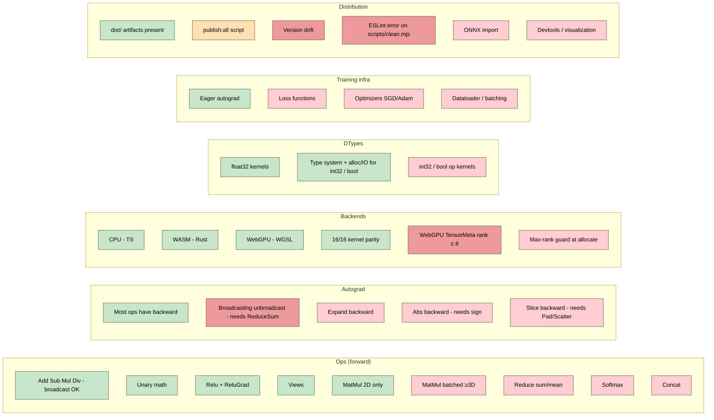

# 05 — State of the Project

Honest audit. Three columns: **Works** (production-quality), **Partial** (usable but with caveats), **Missing** (not implemented). For concrete bugs and severities see [06-bugs-and-gaps.md](06-bugs-and-gaps.md). For roadmap priorities see [next.md](../next.md).

See [diagrams/gap-map.md](../diagrams/gap-map.md).

---

## Forward ops

| Area                | Works                                                                                           | Partial | Missing                                              |
| ------------------- | ----------------------------------------------------------------------------------------------- | ------- | ---------------------------------------------------- |
| Element-wise binary | `add`, `sub`, `mul`, `div` with broadcasting                                                    |         |                                                      |
| Element-wise unary  | `neg`, `exp`, `log`, `sqrt`, `abs`, `pow`, `sigmoid`, `tanh`, `relu`                            |         |                                                      |
| Linear algebra      | `matmul` (rank == 2)                                                                            |         | Batched `matmul` (rank ≥ 3)                          |
| Views (zero-copy)   | `transpose`, `reshape`, `view`, `slice`, `unsqueeze`, `squeeze`, `permute`, `expand`, `flatten` |         |                                                      |
| Memory              | `contiguous`, `clone`, `detach`                                                                 |         |                                                      |
| Reductions          |                                                                                                 |         | `sum`, `mean`, `max`, `min`, `argmax`                |
| Composite           |                                                                                                 |         | `softmax`, `log_softmax`, `concat`, `split`, `where` |
| Indexing            |                                                                                                 |         | `gather`, `scatter`, advanced indexing               |

---

## Autograd

| Area                       | Works                                                     | Partial                                                                          | Missing                     |
| -------------------------- | --------------------------------------------------------- | -------------------------------------------------------------------------------- | --------------------------- |
| Backward closure mechanism | `Tensor.backward()`, topo build, accumulation via `add()` |                                                                                  |                             |
| Per-op gradients           | All listed ✅ in [04-autograd.md](04-autograd.md)         | Add/Sub/Mul/Div backward without unbroadcast (silently wrong when shapes differ) | Abs, Slice, Expand backward |
| Higher-order gradients     |                                                           | In principle works through the closure mechanism but no tests                    |                             |

---

## DTypes

| Area             | Works                                                             | Partial | Missing                                                             |
| ---------------- | ----------------------------------------------------------------- | ------- | ------------------------------------------------------------------- |
| Type system      | `DType` defined once in `ir`; `bytesPerElement`, `typedArrayCtor` |         |                                                                     |
| Allocation & I/O | All three backends allocate/read/write `float32`, `int32`, `bool` |         |                                                                     |
| Op kernels       | `float32` kernels for every registered op                         |         | `int32` and `bool` op kernels (every backend throws on non-float32) |
| Mixed precision  |                                                                   |         | `float16`, `bfloat16`                                               |

---

## Ranks and shapes

| Area                           | Works                                                        | Partial                                                                                   | Missing                                                       |
| ------------------------------ | ------------------------------------------------------------ | ----------------------------------------------------------------------------------------- | ------------------------------------------------------------- |
| Strided model                  | All kernels handle arbitrary strides + offset + broadcasting |                                                                                           |                                                               |
| Rank ≤ 8 on WebGPU             | All current ops fit                                          | `TensorMeta` uniform packs only 8 shape + 8 stride slots — silent corruption above rank 8 |                                                               |
| Rank > 8                       |                                                              |                                                                                           | Not supported on WebGPU; CPU/WASM untested above rank 8       |
| Max-rank guard at `allocate()` |                                                              |                                                                                           | Not enforced (see [06-bugs-and-gaps.md](06-bugs-and-gaps.md)) |
| Dynamic shapes (`null` dim)    | Type system supports it                                      | Engine treats `null` as size-1 in many places; placeholder support stubbed but not wired  | True dynamic shapes for placeholder inputs                    |

---

## Training infrastructure

| Area                  | Works | Partial | Missing                                                         |
| --------------------- | ----- | ------- | --------------------------------------------------------------- |
| Eager autograd        | Yes   |         |                                                                 |
| Loss functions        |       |         | MSE, cross-entropy, BCE — all blocked on reductions             |
| Optimizers            |       |         | SGD, Adam — needs in-place ops or weight-update pattern         |
| Dataloader / batching |       |         | No streaming, no batch sampling                                 |
| Train/eval mode       |       |         | No `train()` / `eval()` toggle (matters for dropout, batchnorm) |
| Checkpointing         |       |         | No serialization format for trained weights                     |

---

## Backends

| Backend | Works                                                                         | Partial                                            | Missing                                        |
| ------- | ----------------------------------------------------------------------------- | -------------------------------------------------- | ---------------------------------------------- |
| CPU     | All 16 kernels                                                                |                                                    |                                                |
| WASM    | All 16 kernels; build via `wasm-pack`                                         | `loadWasmModule()` is async-shaped but synchronous | Multi-threading, SIMD intrinsics               |
| WebGPU  | All 16 kernels; pipeline cache; temp buffer cleanup via `onSubmittedWorkDone` | Rank-8 ceiling on `TensorMeta`                     | Compute shader fusion, async readback batching |

---

## Distribution

| Area              | Works                                   | Partial                                                                                                | Missing                                      |
| ----------------- | --------------------------------------- | ------------------------------------------------------------------------------------------------------ | -------------------------------------------- |
| Build artifacts   | `dist/` exists for all six packages     | Only validated via workspace aliases — never tested in real `node_modules`                             |                                              |
| Versioning        |                                         | Version drift: `backend-wasm` is `0.1.0`, others are `0.0.0`                                           | Lockstep version-bump tooling                |
| Publish script    | `publish:all` exists                    | Untested; assumes Bun ≥ 1.2.0 with built-in publish                                                    | Per-package publish, dry-run, npm provenance |
| Lint / format     | `prettier --write`, `eslint --fix` work | One ESLint error (`scripts/clean.mjs`), one Prettier mismatch (`packages/backend-webgpu/package.json`) |                                              |
| CI                |                                         |                                                                                                        | No GitHub Actions, no automated test runs    |
| Changelog         |                                         |                                                                                                        | None                                         |
| License field     | (root has none in `package.json`)       |                                                                                                        | Add `license` to each package                |
| Peer dependencies |                                         |                                                                                                        | Should `@webgpu/types` be a peer/optional?   |

---

## Documentation

| Area                            | Works                                                                                                               | Partial             | Missing                                  |
| ------------------------------- | ------------------------------------------------------------------------------------------------------------------- | ------------------- | ---------------------------------------- |
| Architecture, IR, kernel recipe | [architecture.md](../architecture.md), [ir-reference.md](../ir-reference.md), [adding-an-op.md](../adding-an-op.md) |                     |                                          |
| Onboarding pack                 | This folder                                                                                                         |                     |                                          |
| Roadmap                         | [next.md](../next.md)                                                                                               |                     |                                          |
| Diagrams                        | `package-map`, `execution-flow`, `backend-internals`, `target-architecture` + 5 onboarding diagrams                 |                     |                                          |
| API reference                   |                                                                                                                     |                     | Generated from JSDoc; no `typedoc` setup |
| Contributor guide               | [07-contributor-guide.md](07-contributor-guide.md)                                                                  |                     | Top-level `CONTRIBUTING.md`              |
| Examples / quickstart code      |                                                                                                                     | README has snippets | `examples/` directory with runnable apps |

---

## Future packages (not yet in tree)

From [next.md](../next.md):

- `@webtensor/onnx` — `.onnx` parser → `Graph`. Slot-fits the existing `compileGraph` shape.
- `@webtensor/devtools` — graph viewer, training dashboard, tensor visualizations.

---

## Where to act

If you want to **unblock real model training**, the critical path is roughly:

1. **Reductions (sum/mean)** — single highest-value change. Unblocks unbroadcast in autograd and unblocks loss functions.
2. **Gradient unbroadcasting** — apply unbroadcast in Add/Sub/Mul/Div backward once `sum` exists.
3. **Batched matmul** — needed for any transformer or batched MLP.
4. **WebGPU rank > 8 / `TensorMeta` redesign** — prerequisite for batched matmul.
5. **Loss + optimizer** — convert "graph evaluator" into "trainer."

If you want to **harden distribution**:

1. Align package versions (lockstep at `0.1.0` or set up a release tool).
2. Fix lint and format.
3. Add CI that runs `bun run test` in browser mode.
4. Add an `examples/` quickstart that uses the published packages (not workspace aliases) — that's the only way to validate the published artifacts.

See [08-rearchitect-notes.md](08-rearchitect-notes.md) for what each of those touches across the codebase.
