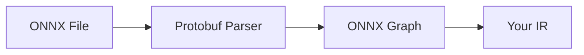
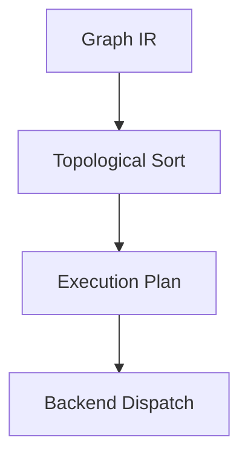
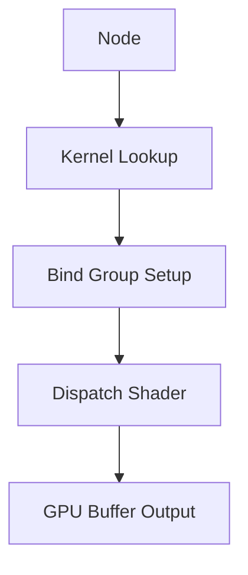
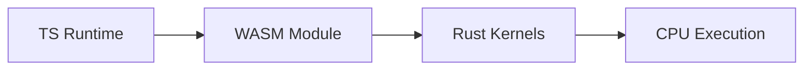
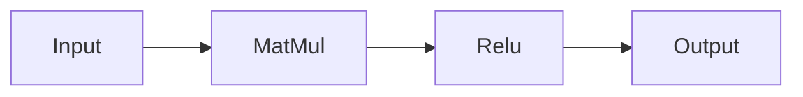
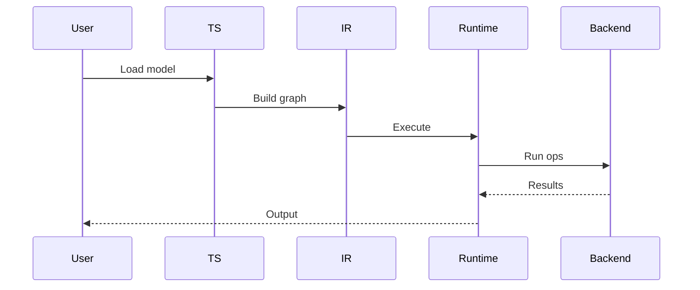
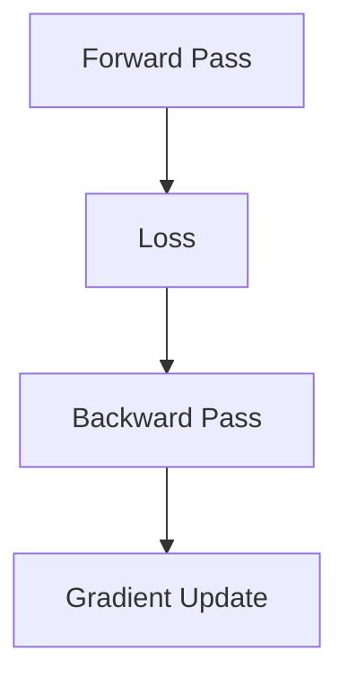
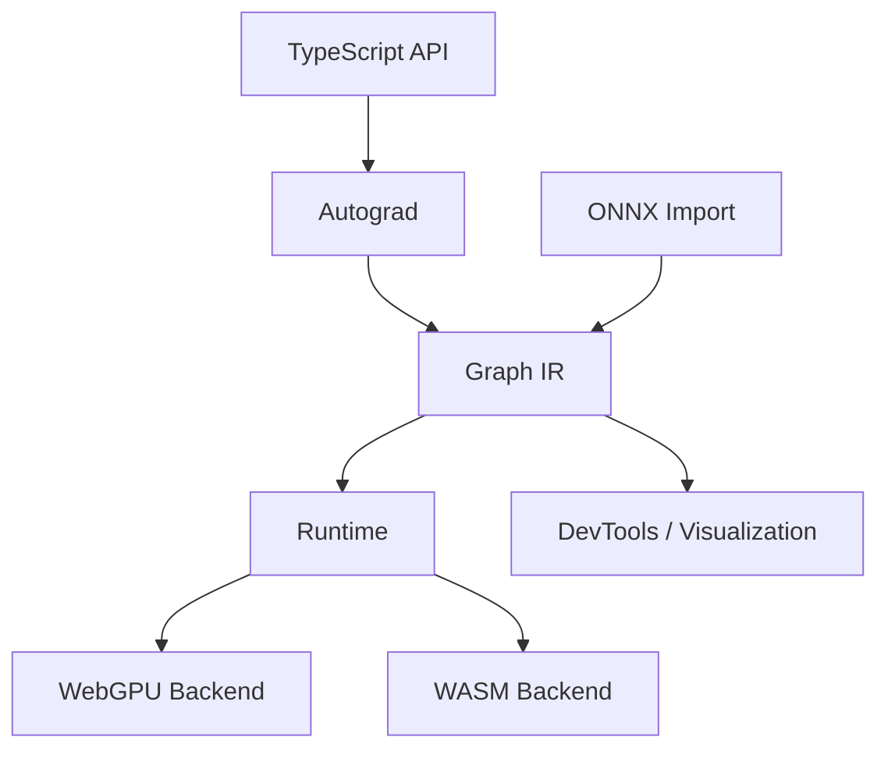

# 🧠 Web-Native ML Framework Design Document

## 1. Overview

### 1.1 Goal

Design and implement a **TypeScript-first machine learning framework** that:

* Allows developers to **define, train, and visualize models in TypeScript**
* Executes models efficiently in the browser using:

  * **WebGPU (primary backend)**
  * **WASM (CPU fallback)**
* Supports **ONNX model import and execution**
* Provides **graph-level introspection and visualization**

---

### 1.2 Non-Goals (for MVP)

* Full ONNX operator coverage
* Distributed training
* Large-scale LLM inference
* Mobile-native SDKs

---

### 1.3 Key Principles

* **Web-first**: Optimize for browser runtime
* **Separation of concerns**: Authoring vs IR vs Runtime
* **Progressive compatibility**: Partial ONNX support first
* **Backend abstraction**: Same graph runs on GPU or CPU
* **Developer experience first**: Debuggable, visualizable

---

# 🏗️ 2. High-Level Architecture

```mermaid
graph TD
    A[TypeScript Authoring API] --> B[Autograd Engine]
    B --> C[Graph IR (ONNX-like)]
    C --> D[Runtime Engine]

    D --> E[WebGPU Backend]
    D --> F[WASM Backend]

    G[ONNX Parser] --> C

    C --> H[Visualization Tools]
```

---

# 🧩 3. System Components

---

## 3.1 Authoring Layer (`@yourlib/core`)

### Responsibilities

* Tensor API
* Autograd (reverse-mode differentiation)
* Eager execution
* Graph construction (optional capture)

---

### Tensor Design

```ts
class Tensor {
  data?: Float32Array
  shape: number[]
  dtype: 'float32'
  device: 'cpu' | 'webgpu'

  requiresGrad: boolean
  grad?: Tensor

  _ctx?: OpContext
}
```

---

### Example Usage

```ts
const x = tensor([1, 2, 3], { requiresGrad: true })
const y = x.mul(2).add(1)
y.backward()
```

---

### Autograd Design

Each operation records:

```ts
type OpContext = {
  op: string
  inputs: Tensor[]
  backward: (grad: Tensor) => Tensor[]
}
```

---

## 3.2 Intermediate Representation (`@yourlib/ir`)

### Purpose

* Canonical graph format
* Bridge between:

  * TS authoring
  * ONNX models
  * Runtime execution

---

### IR Node Definition

```ts
type Node = {
  id: string
  op: string
  inputs: string[]
  outputs: string[]
  attributes?: Record<string, any>
}
```

---

### Graph Structure

```ts
type Graph = {
  nodes: Node[]
  tensors: Record<string, TensorMeta>
  inputs: string[]
  outputs: string[]
}
```

---

### Design Rule

> ✅ IR should be **ONNX-aligned but not ONNX-dependent**

---

## 3.3 ONNX Integration (`@yourlib/onnx`)

---

### Responsibilities

* Parse `.onnx` (protobuf)
* Convert to internal IR
* Map ONNX ops → internal ops

---

### Pipeline



---

### Operator Mapping Example

| ONNX Op | Internal Op |
| ------- | ----------- |
| Add     | Add         |
| Relu    | Relu        |
| Gemm    | Gemm        |
| MatMul  | MatMul      |

---

### Initial Supported Ops

* Add
* Mul
* MatMul
* Gemm
* Relu
* Sigmoid
* Tanh
* Reshape
* Transpose
* Concat
* Softmax

---

## 3.4 Runtime Engine (`@yourlib/runtime`)

---

### Responsibilities

* Execute IR graph
* Manage tensor lifecycle
* Dispatch ops to backend

---

### Execution Flow



---

### Backend Interface

```ts
interface Backend {
  allocate(shape: number[]): Tensor
  runOp(node: Node, inputs: Tensor[]): Tensor[]
  dispose(tensor: Tensor): void
}
```

---

## 3.5 WebGPU Backend (`@yourlib/backend-webgpu`)

---

### Responsibilities

* GPU execution via WebGPU API
* WGSL shader management
* Buffer lifecycle

---

### Execution Flow



---

### Kernel Example (Add)

```wgsl
@group(0) @binding(0) var<storage, read> a: array<f32>;
@group(0) @binding(1) var<storage, read> b: array<f32>;
@group(0) @binding(2) var<storage, read_write> out: array<f32>;

@compute @workgroup_size(64)
fn main(@builtin(global_invocation_id) id: vec3<u32>) {
  let i = id.x;
  out[i] = a[i] + b[i];
}
```

---

### Key Optimizations

* Buffer pooling
* Kernel caching
* Minimize CPU-GPU transfers

---

## 3.6 WASM Backend (`@yourlib/backend-wasm`)

---

### Responsibilities

* CPU fallback
* Deterministic execution
* Compatibility layer

---

### Architecture



---

### Implementation Strategy

* Rust + `wasm-pack`
* Export functions:

```rust
#[wasm_bindgen]
pub fn add(a: &[f32], b: &[f32]) -> Vec<f32>
```

---

### When Used

* No WebGPU support
* Unsupported ops
* Debugging mode

---

## 3.7 Visualization (`@yourlib/devtools`)

---

### Features

* Graph visualization
* Tensor inspection
* Gradient flow
* Performance profiling

---

### Graph Visualization



---

### Developer Tools

* Browser DevTools extension
* React-based graph UI
* Real-time execution tracing

---

# ⚙️ 4. Execution Lifecycle

---

## Inference Flow



---

## Training Flow (Future Phase)



---

# 🧠 5. Memory Management Strategy

---

## GPU Memory

* Explicit allocation
* Buffer reuse pool

```ts
class BufferPool {
  acquire(size: number): GPUBuffer
  release(buffer: GPUBuffer): void
}
```

---

## CPU Memory (WASM)

* Linear memory
* Typed array views
* Avoid copies

---

# ⚠️ 6. Key Challenges

---

### 6.1 Autograd correctness

* Graph tracking
* Gradient accumulation

---

### 6.2 WebGPU performance

* Workgroup tuning
* Memory coalescing

---

### 6.3 ONNX compatibility

* Operator variations
* Broadcasting rules

---

### 6.4 Kernel coverage

* Prioritize common ops
* Progressive expansion

---

# 🚀 7. Roadmap

---

## Phase 1 (MVP)

* Tensor + basic ops
* WebGPU backend
* No ONNX

---

## Phase 2

* Autograd
* Visualization (basic)

---

## Phase 3

* WASM backend
* Backend abstraction

---

## Phase 4

* ONNX import
* Operator mapping

---

## Phase 5

* Optimization
* Graph execution engine
* Kernel fusion

---

# 🔥 8. Future Extensions

* Quantization (int8)
* WebNN backend
* Multi-threading (Web Workers)
* Model compression
* Partial training in browser

---

# ✅ 9. Summary

You are building:

> **A web-native ML framework that unifies development, visualization, and deployment with ONNX compatibility**

---

### Core strengths of your design:

* TS-first developer experience
* WebGPU acceleration
* WASM fallback robustness
* ONNX ecosystem integration
* Built-in visualization

---

### Final Architecture Snapshot



# 🧠 1. Design Goals for Your IR

Your IR must:

### ✅ Be ONNX-aligned

* Same operator names (`Add`, `MatMul`, `Gemm`)
* Similar graph structure

### ✅ Be runtime-friendly

* Easy to execute (topological order)
* Minimal indirection

### ✅ Be extensible

* Add training later
* Add new backends

### ✅ Be inspectable

* For visualization + debugging

---

# 🧱 2. Core Concepts

Your IR has **5 core components**:

```text
Graph
 ├── Nodes (ops)
 ├── Values (tensors flowing between nodes)
 ├── Initializers (weights)
 ├── Inputs / Outputs
 └── Metadata
```

---

# 🧩 3. Full IR Schema (TypeScript)

## 3.1 Value (Tensor in graph)

This is **NOT runtime tensor**, just metadata.

```ts
type Value = {
  name: string

  // Shape system
  shape: (number | null)[]   // null = dynamic dimension
  dtype: 'float32' | 'int32' | 'bool'

  // Data (only for constants / weights)
  data?: ArrayBuffer

  // Who produces this value
  producer?: string   // node id

  // Who consumes this value
  consumers?: string[]

  // Debugging / visualization
  debugName?: string
}
```

---

## 🔥 Key Insight

> Values are **edges in the graph**, not nodes.

This matches ONNX and simplifies execution.

---

## 3.2 Node (Operator)

```ts
type Node = {
  id: string

  op: string   // "Add", "MatMul", etc.

  inputs: string[]   // Value names
  outputs: string[]  // Value names

  attributes?: Record<string, AttributeValue>

  // Optional: for debugging / visualization
  name?: string
}
```

---

## 3.3 Attributes

ONNX-style flexible attributes:

```ts
type AttributeValue =
  | number
  | string
  | number[]
  | string[]
  | boolean
```

---

### Example (Gemm node)

```ts
{
  id: "node_1",
  op: "Gemm",
  inputs: ["A", "B", "C"],
  outputs: ["Y"],
  attributes: {
    alpha: 1.0,
    beta: 1.0,
    transA: 0,
    transB: 1
  }
}
```

---

## 3.4 Graph

```ts
type Graph = {
  nodes: Node[]

  values: Record<string, Value>

  inputs: string[]
  outputs: string[]

  // Initializers = weights
  initializers: string[]  // subset of values

  // Metadata
  name?: string
  opset?: number
}
```

---

# 🧠 4. Example IR (Simple MLP)

### Model:

```text
y = Relu(MatMul(x, W) + b)
```

---

### Graph (simplified)

```ts
const graph: Graph = {
  inputs: ["x"],
  outputs: ["y"],

  initializers: ["W", "b"],

  values: {
    x: { name: "x", shape: [1, 128], dtype: "float32" },
    W: { name: "W", shape: [128, 64], dtype: "float32", data: ... },
    b: { name: "b", shape: [64], dtype: "float32", data: ... },

    mm_out: { name: "mm_out", shape: [1, 64], dtype: "float32" },
    add_out: { name: "add_out", shape: [1, 64], dtype: "float32" },
    y: { name: "y", shape: [1, 64], dtype: "float32" }
  },

  nodes: [
    {
      id: "matmul_1",
      op: "MatMul",
      inputs: ["x", "W"],
      outputs: ["mm_out"]
    },
    {
      id: "add_1",
      op: "Add",
      inputs: ["mm_out", "b"],
      outputs: ["add_out"]
    },
    {
      id: "relu_1",
      op: "Relu",
      inputs: ["add_out"],
      outputs: ["y"]
    }
  ]
}
```

---

# ⚙️ 5. Shape System (IMPORTANT)

You must support:

```ts
shape: (number | null)[]
```

Examples:

| Shape          | Meaning       |
| -------------- | ------------- |
| `[1, 128]`     | fixed         |
| `[null, 128]`  | dynamic batch |
| `[null, null]` | fully dynamic |

---

## Optional: Shape inference hook

```ts
type ShapeInference = (
  node: Node,
  inputShapes: (number | null)[][]
) => (number | null)[][]
```

---

# 🔁 6. Broadcasting Rules (ONNX-compatible)

You must follow:

* Right-aligned broadcasting
* Example:

```text
[1, 64]
[64]
→ [1, 64]
```

---

## Suggested utility

```ts
function broadcastShapes(a: number[], b: number[]): number[]
```

---

# ⚙️ 7. Execution Plan (Derived from IR)

At runtime, convert:

```ts
Graph → ExecutionPlan
```

---

## Topological Sort

```ts
type ExecutionPlan = {
  order: Node[]
}
```

---

# 🧠 8. Backend Execution Contract

Each node execution:

```ts
type KernelContext = {
  node: Node
  inputs: Tensor[]
  outputs: Tensor[]
}
```

---

# 🔌 9. ONNX Compatibility Layer

---

## Mapping Rules

| ONNX Concept | Your IR |
| ------------ | ------- |
| NodeProto    | Node    |
| TensorProto  | Value   |
| GraphProto   | Graph   |

---

## Important: Keep op names identical

```ts
op: "MatMul"  // NOT "matmul"
```

---

# ⚠️ 10. Things to NOT include (yet)

Keep IR clean:

❌ No gradients
❌ No device info
❌ No execution state
❌ No backend-specific logic

👉 IR = **pure graph description**

---

# 🚀 11. Extensions (future-ready design)

You can extend later:

---

## Training support

```ts
type Node = {
  ...
  grad?: boolean
}
```

---

## Quantization

```ts
type Value = {
  ...
  scale?: number
  zeroPoint?: number
}
```

---

## Subgraphs (for control flow)

```ts
type Node = {
  ...
  subgraph?: Graph
}
```

---

# 🔥 12. Final Mental Model

Your IR is:

```text
NOT execution
NOT tensors
NOT GPU

→ PURE COMPUTATION GRAPH
```

---

# ✅ Final Summary

You now have:

### ✔ Clean ONNX-aligned IR

* Node
* Value
* Graph

### ✔ Execution-ready

* Easy topological sort
* Backend-agnostic

### ✔ Extensible

* Training
* Quantization
* Optimization

---

# 🚀 Next Best Step

Now that IR is defined, the highest-impact next move is:

👉 **Build a vertical slice:**

1. Hardcode a small IR graph
2. Implement:

   * `Add`
   * `MatMul`
3. Execute on:

   * WebGPU
4. Print result

